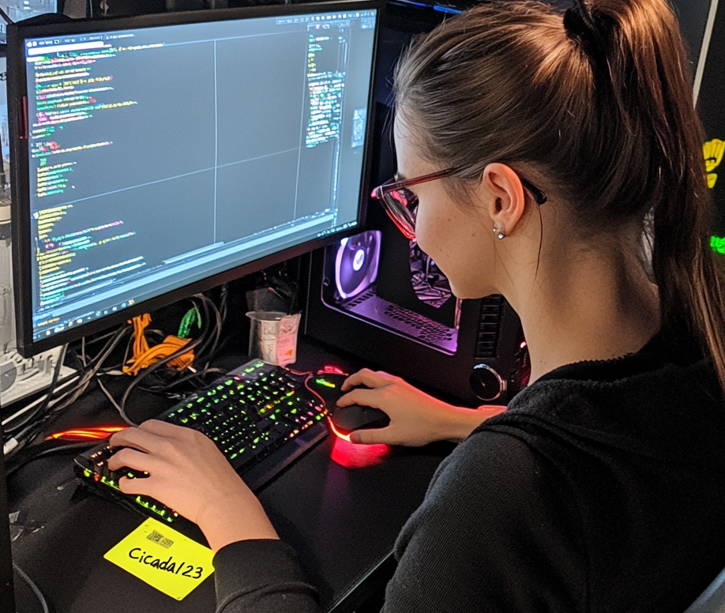

```
PORT     STATE SERVICE
53/tcp   open  domain
80/tcp   open  http
88/tcp   open  kerberos-sec
111/tcp  open  rpcbind
135/tcp  open  msrpc
139/tcp  open  netbios-ssn
389/tcp  open  ldap
445/tcp  open  microsoft-ds
464/tcp  open  kpasswd5
593/tcp  open  http-rpc-epmap
636/tcp  open  ldapssl
2049/tcp open  nfs
3268/tcp open  globalcatLDAP
3269/tcp open  globalcatLDAPssl
3389/tcp open  ms-wbt-server
5357/tcp open  wsdapi
```


NFS Shares --> PRofiles Directory 
--> Found Domain Usernames;
--> marketing.png

```
┌──(root㉿BHASHMA)-[~/BACK_TO_THE_GAME/CICADA_/profiles]
└─# tree
.
├── Administrator
│   └── Documents
│       ├── $RECYCLE.BIN
│       └── desktop.ini
├── Daniel.Marshall
├── Debra.Wright
├── Jane.Carter
├── Jordan.Francis
├── Joyce.Andrews
├── Katie.Ward
├── Megan.Simpson
├── Richard.Gibbons
├── Rosie.Powell
│   ├── Documents
│   │   ├── $RECYCLE.BIN
│   │   │   └── desktop.ini
│   │   └── desktop.ini
│   └── marketing.png
└── Shirley.West

16 directories, 4 files
```





Cool ! we got usernames and Password . Password Sprayin'

