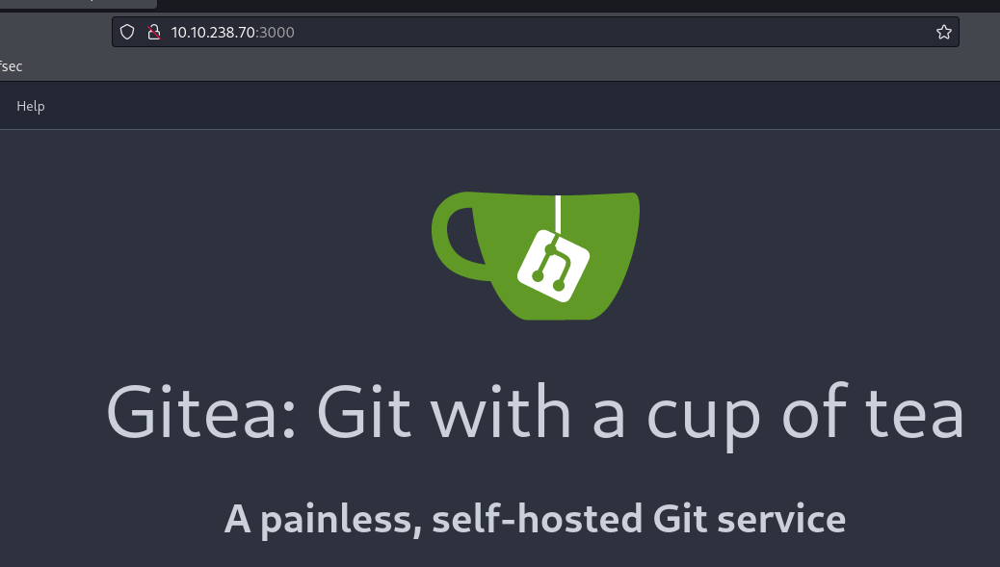

## INFO

```
[*] Windows Server 2022 Build 20348 x64 (name:DC) (domain:tea.vl) (signing:True) (SMBv1:False)

PORT     STATE SERVICE
53/tcp   open  domain
88/tcp   open  kerberos-sec
135/tcp  open  msrpc
139/tcp  open  netbios-ssn
389/tcp  open  ldap
445/tcp  open  microsoft-ds
464/tcp  open  kpasswd5
593/tcp  open  http-rpc-epmap
636/tcp  open  ldapssl
3268/tcp open  globalcatLDAP
3269/tcp open  globalcatLDAPssl
3389/tcp open  ms-wbt-server


[*] Windows Server 2022 Build 20348 x64 (name:SRV) (domain:tea.vl) (signing:False) (SMBv1:False)

PORT     STATE SERVICE
80/tcp   open  http
135/tcp  open  msrpc
445/tcp  open  microsoft-ds
3000/tcp open  ppp
3389/tcp open  ms-wbt-server
```

Cool ! SRV got Git-Tea on port 3000. Lets Explore ! 




