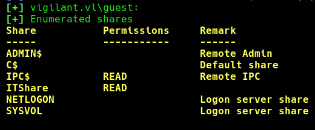
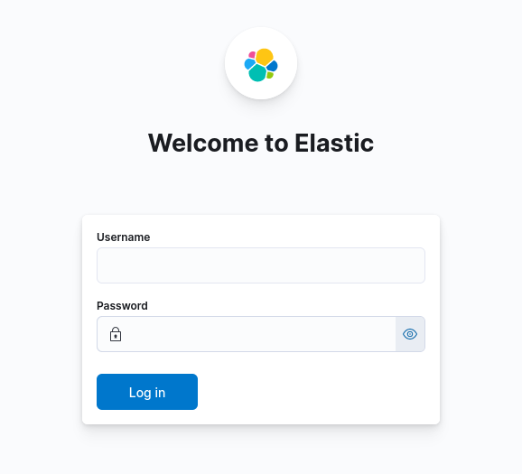
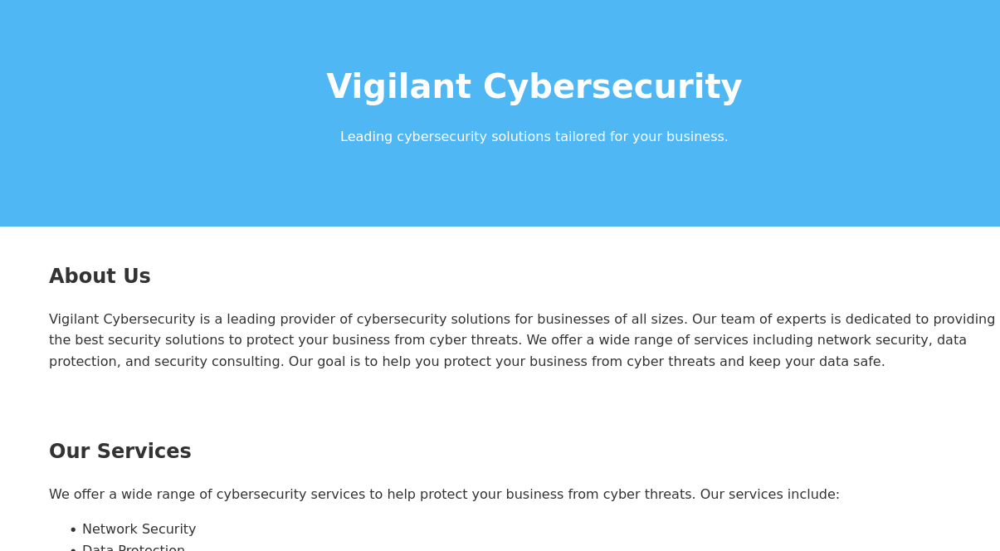

## INFO

```
Machine 0x1
PORT     STATE SERVICE
53/tcp   open  domain
88/tcp   open  kerberos-sec
135/tcp  open  msrpc
139/tcp  open  netbios-ssn
389/tcp  open  ldap
445/tcp  open  microsoft-ds
464/tcp  open  kpasswd5
593/tcp  open  http-rpc-epmap
636/tcp  open  ldapssl
3268/tcp open  globalcatLDAP
3269/tcp open  globalcatLDAPssl
3389/tcp open  ms-wbt-server
5601/tcp open  esmagent
9200/tcp open  wap-wsp


Machine 0x2
PORT   STATE SERVICE
22/tcp open  ssh
80/tcp open  http
```


Anonymous access in the shares of the DC.



Elastic Search is on port 5601 of the DC. But we don't have credentials yet !




Machine 0x2 , webpage.




DEcrypt the PDF from the share , [.NET reversing using dnspy! ]

https://notes.secure77.de/?link=%2FWriteUps%2FVulnLab%2FVigilant%2FWriteup